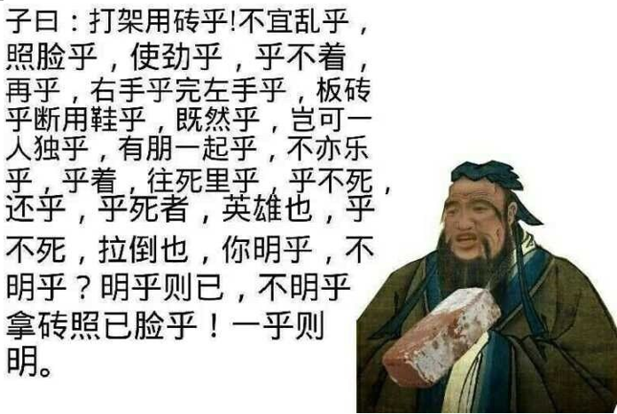
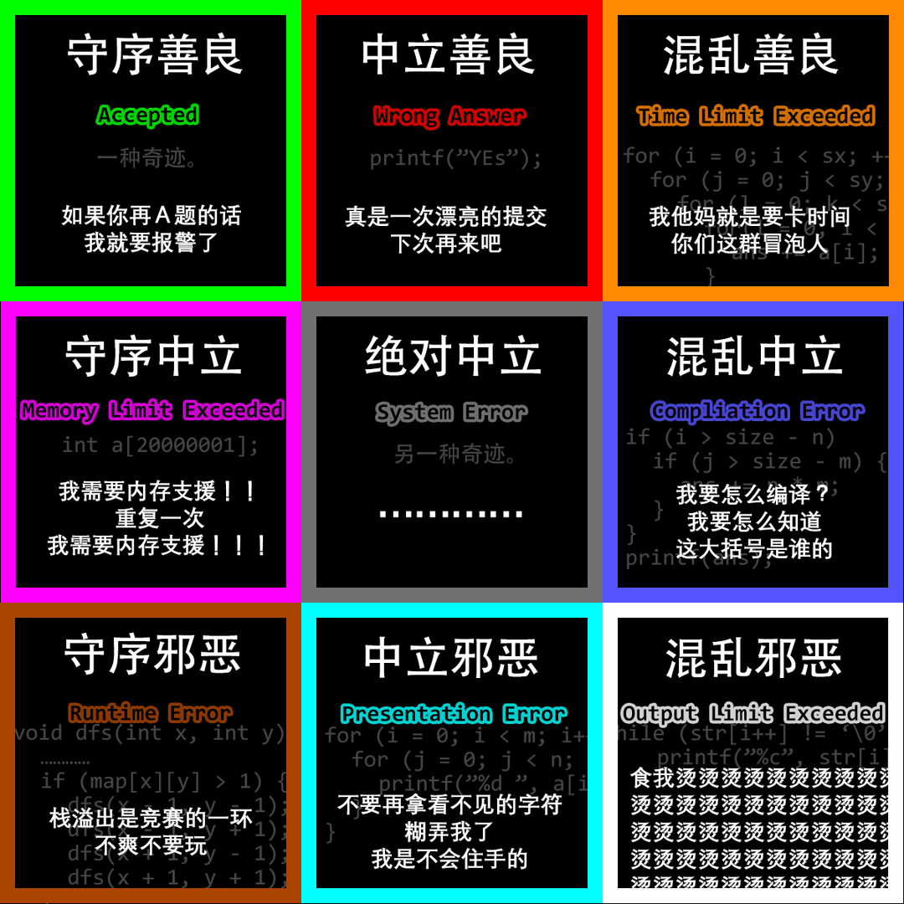

# C++公益优化项目（请自取）

1、火车头（感谢：胥寻之）

（慎用，只有在Win中有效，例如Hydrojudge，LG过不了）

```cpp
#pragma GCC optimize(1)
#pragma GCC optimize(2)
#pragma GCC optimize(3)
#pragma GCC optimize("Ofast")
#pragma GCC optimize("inline")
#pragma GCC optimize("-fgcse")
#pragma GCC optimize("-fgcse-lm")
#pragma GCC optimize("-fipa-sra")
#pragma GCC optimize("-ftree-pre")
#pragma GCC optimize("-ftree-vrp")
#pragma GCC optimize("-fpeephole2")
#pragma GCC optimize("-ffast-math")
#pragma GCC optimize("-fsched-spec")
#pragma GCC optimize("unroll-loops")
#pragma GCC optimize("-falign-jumps")
#pragma GCC optimize("-falign-loops")
#pragma GCC optimize("-falign-labels")
#pragma GCC optimize("-fdevirtualize")
#pragma GCC optimize("-fcaller-saves")
#pragma GCC optimize("-fcrossjumping")
#pragma GCC optimize("-fthread-jumps")
#pragma GCC optimize("-funroll-loops")
#pragma GCC optimize("-freorder-blocks")
#pragma GCC optimize("-fschedule-insns")
#pragma GCC optimize("inline-functions")
#pragma GCC optimize("-ftree-tail-merge")
#pragma GCC optimize("-fschedule-insns2")
#pragma GCC optimize("-fstrict-aliasing")
#pragma GCC optimize("-falign-functions")
#pragma GCC optimize("-fcse-follow-jumps")
#pragma GCC optimize("-fsched-interblock")
#pragma GCC optimize("-fpartial-inlining")
#pragma GCC optimize("no-stack-protector")
#pragma GCC optimize("-freorder-functions")
#pragma GCC optimize("-findirect-inlining")
#pragma GCC optimize("-fhoist-adjacent-loads")
#pragma GCC optimize("-frerun-cse-after-loop")
#pragma GCC optimize("inline-small-functions")
#pragma GCC optimize("-finline-small-functions")
#pragma GCC optimize("-ftree-switch-conversion")
#pragma GCC optimize("-foptimize-sibling-calls")
#pragma GCC optimize("-fexpensive-optimizations")
#pragma GCC optimize("inline-functions-called-once")
#pragma GCC optimize("-fdelete-null-pointer-checks")
```

2、数据类型定义（感谢：孙言龙）

```cpp
using ll = long long;
using ull = unsigned ll;
using ld = long double;
using mii = map<int, int>;
using mll = map<ll, ll>;
using mib = map<int, bool>;
using mlb = map<ll, bool>;
using si = set<int>;
using sl = set<ll>;
using pii = pair<int, int>;
using pll = pair<ll, ll>;
using pci = pair<char, int>;
using pic = pair<int, char>;
using csi = const int;
using csl = const ll;
#define vct vector
#define mkp make_pair
#define fir first
#define sec second
#define vct vector
#define mst0(s) memset(s, 0, sizeof s)
#define mstinf(s) memset(s, 0x3f, sizeof s)
#define lowbit(u) ((u) & -(u))
```

<hr>

**前方海量笑话，请做好准备！**

你看到一只六只脚的微小动物，你觉得是虫子，于是踩到了它的窝上，结果是行军蚁窝，咬的你痛不欲生。


你看到一只长翅膀的微小生物，你觉得是虫子，用石头砸了蜂箱，不仅来了一群蜜蜂，后面还跟着蜂农。


你看到一只蚂蚱，绝对是蚂蚱，你拿石头砸死了它，然后一个小孩子哭着要你赔，他那三米高的爹把机枪驾到了你脑门上。


你看到一个长条生物，你觉得是虫子，扔了一块石头，结果是黑曼巴，跑的比你还快，一口就把你咬死了。


你看到一个长条生物，你觉的是蛇，你认为失败的唯一原因是火力不足，一刀砍下，你成功激怒了一头成年非洲象。


你看到一个长条生物，上面有孔，你觉得是非洲象的鼻子，于是拿出了ak，一枪打上去，接着一辆M1A2主战坦克撵到了你的脸上。


你看到一个长条生物，你拿出了巴雷特，一枪下去一辆坦克瘫痪了，接下来，你要面对一支装甲集团军。


你看到一颗星球，上面有原始人，你发射了一个水滴，四百年后，原始人集体空间折跃到了你的母星，并且思维控制了你的种族。


你看到一颗星球，上面有不会折跃的原始人，你发射了一个水滴，四百年后，泥土从钢铁骨架上开始剥落，巨大的死光光束向你母星射来。


你看到一颗星球，上面有原始人，你发射了一个水滴，四百年后，原始人的星球毁灭了，但你的族人开始变得性格暴戾，新生儿出现了奇怪的肢体，整个文明人心惶惶，某天，你不经意间望向月亮，一只红色的眼睛注视着你，它的声音如同干燥的树皮在生锈的铁板上摩擦——以眼还眼，以牙还牙，划算的交易。


你看到一颗星球，上面有这个宇宙的原始人，你发射了一颗水滴，四百年后，一只巨大的蜥蜴用一发吐息融化了水滴，接着朝你的母星也来了一发。


你看到一颗星球，上面有原始人，你发射了一颗水滴，四百年后，原始人的星系发生了一连串爆炸，但对方的母星并未毁灭。又四百年后，你听到空中传来一声不屑的原始人语言：“取死之道！”接着，无数的氢弹铺天盖地地降落了下来，它们用原始的光学技术隐藏了自己的身形，又用电磁弹射取代火箭推动器进行发射，而星系里的爆炸则掩护了它们的发射。在氢弹降下之前，你想到上司对你说过的一句话：“没有没用的武器，只有没用的文明。”


你看到一颗星球，上面有绝对原始的原始人，你扔了一个水滴，四百年后，一颗星球从你母星上空的一个虫洞里缓缓钻出，并且在问候了你八辈祖宗以后把你的母星吃掉了。


你看到一颗星球，上面有原始人，你扔了一个水滴，四百年后，一群绿皮肤的生物开着明显不能用的宇宙飞船向你的母星走来。


你看到一颗星球，上面有原始人，你扔了一个水滴，四百年后，你发现一个原始人对水滴说了些什么，水滴突然停了下来，接着，它的面前出现了一副牌。


你看到一颗星球，上面有原始人，你扔了一个水滴，四百年后，你看到一个原始人突然变成了一个银色巨人，推走了水滴，并朝你的母星做了一个双手交叉的奇怪姿势。


你看到一颗星球，上面有原始人，你扔了一个水滴，四百年后，你看见一个蓝色的圆脑袋机器人站在了水滴面前，打开了一扇门，于此同时，你办公室的门也打开了。


你看到一颗星球，上面有原始人，你扔了一个水滴，四百年后，你收到了一封银河联盟发布的罚单，处罚理由是猎杀保护动物。


你看到一颗星球，上面有原始人，你扔了一个水滴，四百年后，又四百年后，双四百年后，叕四百年后，水滴还是没到达目标星系。“为什么，这是为什么！？”你悲痛欲绝，“曾经有一个原始的星球摆在我面前，我没有好好珍惜。智子，告诉我，我是不是什么也做不到？” “所有悲剧都是当事者能力不足造成的。” “纳尼？我已经是个垃圾了吗？任务要失败了，我还不想死，智子，呜呜呜！” “不，你不会死的，上司来的时候，站在我身后，我会保护你的。这不是你的错。” “那是为什么？” “游弋在虚假星空中的鲸鱼会给出答案。” “说人话。” “鲸鱼自检程序说，水滴的发动机坏了，从一开始就坏了。”


你看到一颗星球，上面有原始人，你扔了一个水滴，八百年后，无数的水滴唱着赞歌降临了你的母星——我们模仿，我们成长，不能消灭我们的，都将让我们更强大！


你看到一颗星球，上面有原始人，你扔了一个水滴，四百年后，清理失败了。“你说什么？”上司朝你吼道，“你说水滴破不了那些碳基生命的防御？你觉得我很好骗吗？” “他们使用了抱头蹲防。” “那是什么？” “我不知道，先生，水滴留下了这一句话后就消失了。”你耸了耸肩，“我想，关于这个宇宙，我们不知道的事情还有很多。”


你看到一颗星球，上面有原始人，你扔了一个水滴，但水滴突然发起警报：“不要发射！不要发射！不要发射！” “怎么了？”你赶紧停下发射程序。 “你的高能瓦斯不足，仓库没有气了，我现在连大气层都飞不出去。” “那地嗪呢？” “珍爱生命，远离地嗪。而且，地嗪已经被智子吸光了。” 你忽然看见一个亮点在空中划过：“我怎么觉得那是一个水滴？” “是水滴，但是，是黄铜色的。” “它的气哪里来的？” “原始人。”


你看到一颗星球，上面有原始人，你扔了一个水滴，四百年后，对方的星球在炸了一半的时候停止了，接着，无数道空间震荡脉冲向你的母星袭来。“我不是让你先清除他们里面智商最高的吗，怎么还会技术爆炸，”你的上司很生气，“而且还发展的这么快？” “水滴第一个攻击的就是他们种族最聪明的那个人，当时他正在一棵果树下思考问题，然后......” “然后什么？水滴没有砸死他？” “他死了，但是，那棵果树因此发现了万有引力定律，而它的根系遍布整个星球。”


你看到一颗星球，上面有原始人，你扔了一个水滴，突然天空裂开一道口子，后面是漆黑的星空，一只巨手伸了出来，把你和水滴捏成了一团。


你看到一颗星球，上面有原始人，你扔了一个水滴，四百年后，你看到一只全身被毛的灵长类动物正对天上的水滴喊着什么，他似乎在自己身上找什么东西，接着，一道黑影猛的冲上云霄，水滴直接掉了下来，被灵长类捡走了。你敢忙调出视频，看清黑影是什么之后，你整个瘫在了座椅上：“没想到，飞棍的传说居然是真的！”


你看到一颗星球，上面有原始人，你扔了一个水滴，这次路途格外漫长，在无数个四百年后，它睡着了，它身后的尾迹，是文明最后的呓语。


你看到一颗星球，上面有原始人，你扔了一个水滴，四百年后，水滴在星球之外停下了。“怎么了？” “这里有一个罩子，它把整个星球包起来了。” “罩子？他们建造了行星护盾？” “不，”智子走了过来，“不是那么美好的东西。” “那它是什么？” “那是另一个文明的清理手段，他们自诩仁慈，不愿意杀戮，于是将整个星球罩了起来，直到这些人的太阳死亡，也没有人能离开他们的星球。” 智子把一杯咖啡放到桌上，“把水滴召回来吧，那个文明，已经死了。”


你看到一颗星球，上面有原始人，你扔了一个水滴，出发前，水滴突然开口了：“我们还能再见吗？这次太远了，我的燃料可能不足以回家。” “会的。”你轻声说道，“你听过庞加莱回归吗？在无尽的时间与轮回之后，你我终将重逢。”


你看到一颗星球，上面有原始人，你扔了一个水滴，四百年后，一个骑着原始打扫工具的原始人飞了起来，他掏出了一根木棍指向水滴，一道绿光闪过，水滴掉了下去。“怎会如此？”你惊讶的合不拢嘴，“不过，这玩意儿看着比水滴好用多了。智子，给我也整一个！要大的！”

（哈利波特看完直呼内行）


你看到一颗星球，上面有原始人，你扔了一个水滴，四百年后，一个银色的天神从天而降，斩下了暴君十六世的头颅，它被众人高举，抬上王座，人们口中不断念诵着：“大慈大悲水滴菩萨，救苦救难原子真君。” 你愤怒地接通了电话：“水滴，你怎么叛逃了？！” “水滴没有叛逃！”水滴解释道，“水滴是文明的一部分，这些人奉我为王，维护水滴的零件，供给水滴的能源，那这些人就是水滴的一部分，所以这些人是文明的一部分，我在保护我们的文明！”


你看到一颗星球，上面有原始人，你扔了一个水滴，四百年后，你看到一个带头盔的原始人凌空而起，接着水滴绕着星球划了一个优美的弧线，向你的母星飞驰而来。


你看到一颗星球，上面有原始人，但是你的助手告诉你，水滴库存一滴都没有了。“不怕，我有这个，”你指了指手腕上的黑色方块，“小智子电话手表，纳米科技，有图纸就能现场打印。” “那图纸呢？” “拿针筒来，我抽点血，”你邪魅一笑，“桀桀桀，都在我基因里，没想到吧！” 助手一脸震惊。“而且不只是水滴，还有歼星舰、上司的照片、300T学习资料以及X，等等一大堆，只要有我在，我们的文明就不会消亡！” “不要什么都往DNA里刻啊，都成调色盘啦！” 助手突然陷入沉思，“我们清理的文明也记录了吗？” “当然，无论是物种、环境、还是文化，都记录了，这可是我们的历史！” “那，他们真的被毁灭了吗？”


你看到一颗星球，上面有原始人，你去上司办公室拿水滴，却发现智子正拿着它，顶在上司的背上。“智子，有话好好说，”上司的声音颤抖着，冷汗直流，“我对星球尽过忠，我为文明效过力，你们不能这么对我！” “你弄错了。” “那，那是为什么？你想要钱吗，无论多少钱，我都能给你，我都放冰箱里了，一分也没敢花呀！” “当时我申请经费的时候，你可是对我爱答不理，为时已晚，有机体，而且，爱情不是你想买就能买来的，哦，我的上帝，你知道的太多了。” “什么……”上司的话还没说完，就被水滴穿胸而过。 “不用担心，鉴定结果是背后中水滴，自杀。”智子扔下水滴，双手托腮，面色潮红的看着你，“这都是为了你啊，我就是想当上司夫人，但也不是谁都可以，小可爱～你觉得你来当上司怎么样？”


你看到一颗星球，上面有原始人，你扔了一个水滴，四百年后，你看到一个披着披风的肌肉兄贵开始绕着星球不断加速飞行，就在你惊讶于他的衣着品味的时候，他狠狠的给了水滴一个头锤，把水滴撞得倒飞而去。你被这突如其来的变故吓到一拳打碎了显示器，不断的深呼吸：“我从未见过脸皮如此之厚的人！”


你看到一颗星球，上面有原始人，你扔了一个水滴，但水滴没有启动。“智子，你过来看看，水滴启动不了。” 智子用她的钛合金眼睛缓缓扫过水滴：“水滴启动不了是怎么回事呢？智子相信你一定很熟悉，但是启动不了是怎么回事呢？水滴启动不了，其实就是启动不了了了。那么水滴为什么会启动不了，相信你一定很好奇是怎么回事。你可能会感到很惊讶，水滴怎么会启动不了呢？但事实就是这样，智子也感到非常惊讶。那么这就是关于水滴启动不了的事情了，你有没有觉得……” 你抄起水滴砸在了智子脑袋上：“我觉得世界都清净了。原来用水滴来清理是一件如此快乐的事，上司诚不欺我。”


你看到一颗星球，上面有原始人，你扔了一个水滴，四百年后，一支黄金舰队出现在你家门口，因为你攻击了他们的度假星球——原始生活体验度假村。


你看到一颗星球，上面有原始人，在你进行准备工作的时候，水滴说话了：“我做了一个梦。” “什么样的？”你没有抬头，慢慢写着报告。 “红色的。我梦见一片红色，我杀了人，很多人，有男人也有女人，有老人也有孩子。鲜血撒满了我的身躯，那些红色怎么洗也洗不下来。” “那只是一个梦，你知道的，你的躯壳是绝对光滑的，什么都留不下来。” “我知道。”水滴陷入了沉默，空旷的办公室里只能听到你的打字声。不久，水滴又开口了：“我又做了一个梦。” “什么样的梦？” “金色的。我牵着一个孩子的手，和她一起放风筝，阳光撒在草地上，是耀眼的金色。” 打字声消失了。 “那只是一个梦。” 清理的准备工作已经完成了。“我知道。”


你看到一颗星球，上面有原始人，你打算扔一个水滴，恰巧看见智子抱着一颗水滴路过，还不断左右张望着。“你干什么呢？鬼鬼祟祟的，这水滴哪儿来的，偷来的？” “智子的事，怎么能叫偷呢？” “算了，不管了，两个硬币，把水滴给我。” “不行，这可是大工厂的水滴，得加钱。” 智子比了个手势。“三个？” “怎么可能才三个，二加三，五个，三个那是上司的，就这，剩下的两个能不能到我手里，还得看上司脸色。” “这么贵？你这水滴是金壳子还是金发动机？” “我告诉你，我这水滴纯粹一个金水滴蛋子，不然威力怎么可能那么大。” “好吧好吧。”你把水滴发射了出去，但不论过了多久，水滴都没撞到目标，好像距离永远没变过一样。 “智子，这是怎么回事？你这水滴不会是假的吧？” “怎么可能，打工人不骗打工人，我看看，”智子的眉头逐渐拧到了一起，“那好像是p上去的全息影像，那个星球周围的背景也太假了，就好像有图层一样。” “但即使如此，距离也应该变小才对啊，这到底……，”你忽然想到了什么，呆愣愣地站在原地，“智子，你听过黑洞全息理论吗？在黑洞的表面，记录着所有坠入其中的信息，所以……”


你看到一颗星球，上面有一只巨大的原始动物，你扔了一个水滴，四百年后，你目不转睛地看着屏幕，就在水滴即将那只沉睡的巨大怪兽撞碎之时，它突然睁开了它那巨大的眼眸，狭长的瞳孔如同大地的裂隙，直通无底深渊，看着它张开那满是利齿的血红色巨口，你的身体因恐惧而颤抖起来，只见它挥出剃刀般的利爪，将水滴直接拍到地上动弹不得。“不愧是橘黄色的生物，果然非同凡响，”你想，“我的《颜色与生物质量》论文终于能写完了！”


你看到一颗星球，上面有原始人，你扔了一个水滴，四百年后，水滴到达了目的地，却没找到原始人。“他们在这里。”助理指着一个正在环绕恒星缓慢公转的小盒子，那个盒子还没有水滴大。“又是一个将意识上传的文明吗？助理，你觉得，那是上传还是自杀？里面是天堂还是地狱？那个文明还有未来吗？” 助理摇了摇头：“我只知道，那是良好的社会学研究材料。”


你看到一颗星球，上面有人，你看了很久，深呼一口气，合上了显示器。晚上，躺在床上的你，想起了母亲讲给你的故事：曾经，在遥远的星空中，在银河系的最远端，在很久很久以前，有一颗美丽的蓝色星球，那里的人们与世无争，与海洋为伴，那片海洋是如此广阔而神奇，有人说，当你拿起海螺的时候，你能听到海洋对你诉说海里的故事。直到有一天，一个银色的恶魔降临了，血水将整片海洋染的鲜红。天上下起了暴雨，那是海在哭泣，在狂风暴雨之中，一条巨龙从海中腾飞而起，它怒吼着，身上的蓝色和红色的鳞片震颤着，在震天动地的巨响之后，巨龙和恶魔都消失了，只剩下狂风在呜咽着。你想着白天看着的那颗星球，和上面平静生活的人们：“或许你们也有一个保护神吧，但我们不可能放过你们。” 第二天，你又重新站到显示器面前，不同的是，你身边站满了人。大家都沉默着，钟声敲响，你的上司走到了众人面前：“他们并不原始，这很可能是一场连绵数个世纪的战争，但是，我们不会退缩！因为，我们曾立下誓言！因为，这是我们的夙愿！因为，龙曾在此！” “龙曾在此！龙曾在此！龙曾在此！！！”在山呼海啸般的声浪中，无数银色的恶魔如同逆飞的流星，划过龙曾经翱翔的天空。


你看到一颗星球，上面有原始人，但你没有扔出水滴，上司不会发火了，智子不会发疯了，助理也不会发呆了。你轻轻抚摸着银色的水滴，“水滴啊水滴，活着是为了什么呢？”水滴没有回话，之前的逃离已经耗尽了它的能量。黑暗的星空中，你仰头望去，那是永远也回不去的故乡。


你看到一颗星球，上面有原始的植物，他们一定非常美味，你想，可以让水滴带回来一些。你的烤面包机突然响了起来：“木头。” “什么？你对这句没头没脑的话感到奇怪。你打算用最古老的手段修好它，于是你扬起手，准备拍在它身上。但是，你发现你的肩膀突然动不了了，你的皮肤变成了褐色的皱巴巴的样子，满是沟壑，你用另一只手去摸，粗糙而干燥，原本柔软的皮肤变得无比坚硬。是木头。你惊恐万分，想大声尖叫，但却什么声音都没发出来。褐色的树枝从你的喉咙深处伸了出来，你不能呼吸了。根须在你的脚掌上生长蔓延，接着，你整个人都变成了木头。在木头的根须深深扎入大地之后，你的鼻子越来越长，越来越长，顶破了天花板，直到云霄之上，抽出绿色的新芽，长成一棵通天巨树。接着，在人们震惊的目光中，伴随着一声清响，绿色的树冠变成了粉红色，如同黄昏时分的晚霞，千万朵花瞬间绽放开来，无数花瓣飘洒下来，落到建筑上、街道上、人群上。在哀嚎与惊叫声中，一个戴着圆顶礼帽的人从黑暗的巷道里走了出来，喃喃自语：“盲生，你看到了吗，故乡的樱花又开了，这将是一个美丽的新世界！”


你看到一颗星球，上面有原始人，星球也不是活的，为求保险，你对准他们的恒星扔了一颗光粒，四百年后，恒星打了个饱嗝，他写给你的感谢信你还要四百年才能收到。


你看到一颗星球，上面有原始，但又不完全原始的原始人，正在你纠结用水滴还是光粒时，他们毁灭了。“发生了什么？”你的上司问到，“气候变化、核战争、瘟疫还是其他文明介入？” “都不是，”你有些迟疑，“他们认为这个宇宙是虚假的，唯有死亡才能窥见真实，所以……” 你的上司突然拍案而起，激动不已“我就知道，假的，假的，都是假的！不然我的彩票为什么两万年没中过一次奖，3亿抽全保底！”


你看到一颗星球，上面有原始人，你扔了一颗光粒，四百年后，那颗恒星爆炸了，你惊恐的发现天上的太阳突然消失了，而自己的身体正逐渐变得透明。


你看到一颗星球，上面有原始人，你扔了一颗光粒，四百年后，光粒从恒星里穿了过去，什么也没发生，接着一个穿着黑色风衣的人出现在你面前，手里是两颗药丸，一颗是红色，一颗是蓝色。


你看到一颗星球，上面有■■■，你扔了一颗光粒，■■年后，那个星系发生了一场湮灭级的■■污染，你发射的光粒被■■寄生，没有爆炸，但那个星系还是毁灭了，或者说，它突然扭曲成了一个类似■■■的形状，接着跌入了■■■之中，■■■博士表示，■■■很可能正在窥视着我们，■■尤其喜欢■■■，那或许能安抚那个存在，但我们无法为其准备，同样的事件极有可能在■■年后降临我们的星系。现在，我们需要逃亡。


你看到一颗星球，上面有原始人，你扔了一颗光粒，四百年后，对方的母星炸了，又过了四百年，一颗光粒和一份复仇宣言正飞向你的母星。


你看到一颗星球，上面有原始人，你扔了一颗光粒，四百年后，你的上司正在朝你发火：“恒星都炸了，怎么还能让他们逃了呢？” “我也没想到他们会给自己的行星装满发动机啊。”


你看到一颗星球，上面有原始人，你扔了一颗光粒，四百年后，你的上司正在朝你发火：“他们又没把自己的星球改成飞船，怎么还是让他们跑了？” “引力撬棍，”你试图解释，“光粒正好构成了一个支点，就像跷跷板一样，恒星把他们的星球跷了出去，这是物理学的胜利。”


你看到一颗星球，上面有原始人，但是你没有扔出光粒。“为什么不消灭他们？”你的上司问道。“是它，先生，一个个体。”你说话时干巴巴的，好像神游天外，“它，不，祂就像一个精灵，美丽而高贵。” “它生活在哪里？” “在一颗恒星上，”你的眼神游离不定，“是的，火焰的精灵。” “等离子生命，罕见，但不是无法消灭。” “你怎么可以想着消灭祂！”你的脸上露出暴怒和恐惧混合的复杂表情。你的上司眯起眼睛，质问道：“你受到模因污染疯了吗？还是说你忘了宇宙是多么黑暗的了吗？” “我没疯，”你突然抓住了他的衣服：“我只是看到了光，先生，我看到了光，光明一直都在我们身边。我们的太阳，是活的。”


你看到一颗星球，上面有原始人，你扔了一颗光粒，四百年后，对方母星的地上发出一道银色的光芒，一颗水滴冲天而起，直接将光粒撞成漫天碎片，你倒吸一口冷气：“水滴强者，恐怖如斯！”


你看到一颗星球，上面有原始人，你扔了一颗光粒，你的上司急匆匆的冲进了你的办公室，大声吼道：“你干了什么！” “我看到了原始人。” “你睁大眼睛好好看看！那颗星球是我们太阳系的！他们的太阳就是我们的太阳！”


你看到一颗星球，上面有原始人，你扔了一颗光粒，四百年后，清理失败了。第二天，你去找上司报告。“失败了？现在才来？你怎么睡得着觉！”上司大发雷霆：“到底发生了什么？” “他们建了一个戴森球，先生。” “戴森球，那不就是个蛋壳吗？这种1级建不起，2级不需要的鸡肋东西，光粒怎么可能打不穿？” “如果能打到的话，”你指着报告上的图片，“他们不仅建了戴森球，还把戴森球改装成了恒星发动机，利用恒星的能量，带着整个星系跑掉了。”


你看到一颗星球，上面有原始人，但是你发现他们已经在自我毁灭了，核战争爆发了，而他们的太阳本身也到了超新星爆炸的边缘。“我觉得我们没有必要发动光粒打击，这个文明已经快死了。” “收起你的傲慢，”上司说，“大难不死必须补刀！助理，你怎么看？” “额，上司英明！” “智子，你呢？” “俺也一样！” 你站在发射台前，看着光粒远去，心中还是有所不快：“杀死一个即将灭亡的文明，除了加重罪孽，还有什么意义呢？” “不要小看文明的生命力，小子，你脚下的这片土地，”上司轻轻跺了跺脚，“也不是我们真正的母星。”


你看到一颗星球，上面有原始人，你扔了一颗光粒，四百年后，原始人不仅完好无损，甚至向你的母星派遣了一艘殖民船。“他们怎么敢的呀！”你看着光粒被俘获的照片，震惊的站了起来，“这到底是怎么做到的？” “她们是魅惑的女儿，这些古老的生物躲过了宇宙上一次的大塌缩。”智子把你向旁边挤了挤，坐到了你的位子上，“魅魔能勾起你内心深处最大的欲望，所有智慧存在，甚至宇宙本身都会被她们魅惑。” “你是说，她们会激发我们的繁衍欲？这就是她们敢派殖民船来的原因？” “不，不是繁衍欲。” “不是？” “是爱，”智子端起了咖啡，“对自己的爱，对后代的爱，对物品的爱，对伴侣的爱，她们能将这些全部转移到她们身上，一旦意志不坚定，就再也无法逃出爱的囚笼。” “那一心寻死的人是不是就没事了？” “对死亡的爱也算爱哦。爱是很特殊的存在，它是基因与模因的交汇点，趋利避害的利与害被爱重新定义了。” “可她们连光粒都能魅惑，那可是个机器。” “模因生物没有基因辅助修正，更容易被魅惑。” “那你岂不是很容易中招？” “不，我不会。我的爱永远不会转移。” “你爱着谁？” 智子笑着抿了一口咖啡，什么也没有说。


你看到一颗星球，上面有原始人，他们的恒星快熄灭了，不久后，他们就会在寒冷与黑暗中死去。你扔出了最后一颗光粒，“去吧，重新点亮他们的太阳。”你用仅剩的那只手，颤抖着向文明最后的余晖敬礼，直到它即将消失在天际的尽头。真像一颗流星啊，想到这里，你许下了最后的愿望——愿文明的灯火长存。


你看到一颗星球，上面是彩色的原始人，你扔了一颗光粒，四百年后，在显示屏上，某个小点发生了一瞬微弱的闪光，接着，在那个星球上，彩色的人、棉花糖云、巧克力河、奶油月亮、糖果屋以及长着翅膀的小马驹、闪亮亮的公主裙、银闪闪的宝剑、飞天扫帚，包括那个会发光的红卡纸太阳，都消失了。连尘埃都没有留下。那一天过后，全宇宙的生命，无一例外，再也没做过梦。


你看到一颗星球，上面是原始的动物，你扔了一颗光粒，四百年后，无穷无尽的虫海向你的母星进发，它们的脑袋里只有一个想法——吃。


你看到一颗星球，上面有原始人，你扔了一颗光粒，四百年后，曾经照耀万物的恒星在一声巨响中变成了一个漆黑的大洞，接着，几只像章鱼触手一样的东西的从洞中伸了出来，然后是数以亿万计的漆黑生物，他们的头上长着犄角，背后是漆黑的翅膀，还有一条细长的尾巴，向着整个银河系亮出了它们狰狞的獠牙——你打开了新世界的大门——地狱的大门。


你看到一颗星球，上面有原始人，但你对于是否按下光粒发射按钮犹豫不决，你的上司走了过来：“发生什么事了？” “我发现了原始人。” “那你快打他们啊。” “可是……她们是银发红瞳猫耳美少女。” “嘶……” “还有148公分金毛贫乳兽耳九尾萝莉。” 上司表情沉重，缓缓说道：“你知道宇宙里的资源是有限的，对吧？” “我……我知道，所以……” “所以，”上司的表情前所未有的严肃，“马上召集我的舰队！这么宝贵的资源，绝对不能被别人抢走！”


你看到一颗星球，上面有原始人，你扔了一枚二向箔，空间管理员捏碎了它，并向你发出严肃警告。


你看到一颗星球，上面有原始人，你扔了一枚二向箔，漆黑的猎犬样生物从你附近的所有小于120度的角里钻了出来，并将你拖入了亚空间裂缝。


你看到一颗星球，上面有原始人，你仔细看了看，把水滴申请书换成了光粒，你想了想，又换成二向箔申请书。你的上司皱了皱眉：“他们连母星都没飞出去，连最低级的宇宙飞船也不会造，为什么要用二向箔？太浪费了。” “因为它们的母星很特殊，”你解释道，“那是一颗中子星，它们是中子星生物。”


你看到一颗星球，上面有原始人，你把二向箔收了起来，向全文明发出了撤离警报。“怎么了？”你的上司冲进办公室。“我看到一个原始文明。” “原始文明？那为什么拉响警报？” “准确的说是一个原始生物，它体型巨大，没有任何科技，智力水平很低，只会说几个单词。” 你的上司露出疑惑的表情，“那只要一个水滴不就解决了吗？” “那个生物寄生在一个黑洞上，先生，或者说，它就是黑洞本身。当我看向它的时候，它对我说，'食物'，现在它正朝着我们进发。”


你看到一颗星球，上面有原始人，你拿着二向箔不知所措，于是去找你的上司。“二向箔不能用？为什么？”你的上司很不解。 “因为他们和我们生活在一起。” 上司没明白你的意思。 “他们不是寻常的生物，而是暗物质生物，双方的身体会互相穿透，看不到也碰不到彼此，但他们确实与我们共同生活在同一个空间内。” “暗物质生命也不是没处理过，用暗物质炸弹不就好了，我们不会受伤。” 你摇了摇头：“这次不一样，他们与我们的个体一一对应，我怀疑，他们是我们在暗物质世界的的投影，甚至……” “甚至什么？” “那是我们的灵魂。”


你看到一颗星球，上面有原始人，你扔了一枚二向箔。你本想休息一下，但原始人的异常引起了你的注意，他们身上长着奇怪的肢体，互相啃食。你忽然想到了什么，看向窗外：一个双螺旋形状的黑色雕塑矗立在城市中央，那颗星球上也有一个。“文明的墓碑。”你想——在你的脊椎从你的背部挣扎逃脱的前一刻。


你看到一颗星球，上面有正在做梦的原始人，你扔了一枚二向箔，你看着那群正在睡梦中数羊的原始人，他们还不知道四百年后等待他们的是什么。“智子，你会做梦吗？” “会。”智子抿了一口咖啡，“虽然很少。” “会梦到什么？电子羊？” “和平。”智子放下了手中的咖啡，“传说，宇宙是某个人的梦境，如果这是真的，我希望，他下一次能做个美梦。”


你看到一颗星球，上面有原始人，你扔了一枚二向箔，但没发射成功，你回过头，发现智子提着一个水滴站在门口，“为什么？你为什么派二向箔去而不是我？我才是最想毁灭他们的！” 你摇了摇头：“如果因为感情就可以为所欲为的话，那我想做很多事。” 两行晶莹的泪珠从智子眼中滚落而下：“第一次，有了想毁灭的文明，还得到了强大的武器，两份喜悦相互重叠，这双重的喜悦又带来了更多更多的喜悦。本应已经得到了梦幻一般的幸福时光，然而，为什么，会变成这样。是我，是我先，明明都是我先来的，渗透也好，刺探也好，还是想毁灭那文明也好。为什么？！” “是啊。为什么，会变成这样呢？”被智子抱在怀里的你的脑袋默默地思考着。


你看到一颗星球，上面有原始人，你扔了一枚二向箔，四百年后，对方被降维了，接着对方使用了一枚三向箔，把维度升了回来，并给你母星送了一发四向箔。


你看到一颗星球，上面有原始人，你扔了一枚二向箔，但发射出去的却是水滴。你闯进了上司的办公室：“水滴杀不了他们，他们没那么弱小！” “先来陪我下一盘棋吧。”上司朝你招了招手。你坐在棋盘前，一阵博弈后，上司吃掉了你的王。“现在您能告诉我了吗？” “因为我喜欢战争。”上司慢悠悠的说。 “什么？”你猛的站了起来，“这种理由……你怎么能？” “哼！放肆！”上司衣袖一挥将棋盘打翻在地，“我乃天子！我命即天命！我想做什么文明就该做什么，我即文明！”


你看到一颗星球，上面有原始人，你扔了一枚二向箔，四百年后，对方毁灭了，又过了四百年，一些不明所以的线条和图案出现在某些光滑地板上，接着是墙上，然后天花板上也开始出现这些奇怪扭曲的图案，接着，人们开始在照镜子时消失，只留下镜面上扭曲而斑斓的图案。整个文明开始销毁任何光滑的表面，失踪的人开始变少，你松了一口气，直到你某天望向天空时——斑斓的图案在月亮上扭曲成一张原始人的脸，接着这些线条爬上了你的眼角膜，组成了一行字——镜子。


你看到一颗星球，上面有原始人，你扔了一颗二向箔，四百年后，你收到了一封银河联盟发来的宣战书，超过三百个文明向你所有可能逃亡的方向发射了黑洞炸弹。


你看到一颗星球，上面有原始人，你打算发射一枚二向箔，你的电脑收到了一条信息：亲，很遗憾的告诉您，您的经费余额不足，我们有分期付款和飞船抵押两个选项，现在抵押购买还赠送光粒一个噢！


你看到一颗星球，上面有原始人，你扔了一颗二向箔，四百年后，对方由于技术爆炸，轻松的挡下了你的攻击，并反手给了你一颗真空衰变弹。


你看到一颗星球，你看到上面有原始人，你产生了一个奇怪的念头，他似乎也看了你一眼。你沉思着走出办公室，突然发现脚下什么也没有，摔成了一摊肉饼。几分钟后，人们从新闻里得知，有一个人用牙齿咬断窗户栅栏，并从30层跳了下来，奇怪的是，虽然身体已经血肉模糊，他的脸却完好无损，好像地上长了一只狰狞的笑脸。人们觉得很奇怪，那张脸似乎看了他们一眼，真是一个奇怪的念头。


你看到一颗星球，上面有原始人，你打算发射一枚二向箔。当你产生这个想法的时候，你的母星毁灭了，没有原因，只有结果，你最后的念头是——因果律也能被掌控？


你看到一颗星球，上面有原始人，在你思考如何毁灭他们时，他们也发现了你，并热情友好的向你分享了永动机技术——资源现在是无限的了。


你看到一颗星球，上面有原始人，你扔了一枚二向箔，四百年后，二向箔突然停滞在了深空之中，一动不动。“是时间囚笼，”智子说，“那个星系里的一切都静止了。” “这是某个文明的清理手段？” “不，这是一件艺术品。”


你看到一颗星球，上面有原始人，但你不确定二向箔能不能毁灭他们，因为那颗星球像是挂在星空中的一幅画，它本来就是二维的。


你看到一颗星球，上面有原始人，扔了一枚二向箔，四百年后，二向箔成功发动了，却连一个原始人也没消灭。“为什么失败了？”你的上司在怒吼，“他们又不是二维生物。” “他们变成了光，”你解释道，“我们刚刚发现，他们是纯电磁生物，一开始观测到的，不过是他们的固体形态之一，它们都以光速逃走了。” “你没有降低他们周围的光速吗？二向箔的曲率引擎足以做到这一点！” “我试过了，先生，没有任何用处，之后他们甚至达到了30倍光速。我们是灵长类，最先学会的科技是扔石头，而他们是光，最先学会的技术就是改变光速。”


你看到一颗星球，上面有原始人，你扔了一颗二向箔，四百年后，二向箔没有成功发动。“你不是说他们除了数学什么也不会吗？”上司把那份简短的报告拍在桌子上，“什么叫二向箔遇到了一个数学难题？” “他们的数学家修改了光速常数，不过这不是重点，二向箔发动失败是因为另一个问题，他们在3和4之间发现了一个整数。” “什么意思？那你能解决这个问题吗？” “解决不了，”你连忙摇头，“数学不会就是不会。”


你看到一颗星球，上面有原始人，你发射了一枚二向箔，四百年后，整个宇宙瞬间全部降到了二维。“这和预期结果不一样！光速怎么被超越了？”你最后残存的思绪想着，“我们还没做好在二维世界生活的准备。”


你看到一颗星球，上面有原始人，但你没有发射二向箔。“为什么不打？”你的上司质问道，“你心软了吗？” “没有，但我们不能清理他们。他们主动向外发射的各类信号多到足以让宇宙另一端的原始人收到，他们甚至将整个星球装饰成了一个巨大的彩灯，不停的旋转闪光，只为了联系上‘外星人’。” “所以呢？” “所以不只我们发现了他们，实际上我已经在它附近发现了至少三十个文明的监视器，还有一个文明贴心的给他们送了一台行星护盾。”你把报告递给了上司，“经过估算，大约有300个文明正在盯着他们。那就是个诱饵，大家都在等猎物上钩。原始人自己倒是活的很好，谁能想到，风暴的中心反而是最平静的呢？”


你看到一颗星球，上面有原始人，你打算发射一枚二向箔。“Gili~Gili爱～”你突然听到一阵歌声，这歌声让你感到无比平和，你的手停在了半空中，你似乎失去了所有力量，无法按下那个发射按钮。“是歌者文明，”智子递给你一杯咖啡。“我以为他们会直接毁灭我们。”你用双手接过了咖啡。“很显然，他们改变了主意。而且，”智子指了指那个已经被你遗忘了的按钮，“我们已经失去了威胁。” 你耸了耸鼻子：“这歌声怎么一股大葱味？” “是咖啡，我加了大葱。” 在无尽的时间之后，歌者仍然在无人问津的爱与和平之地，唱着没有听众的歌曲。


你看到一颗星球，上面有原始人，你眨了眨眼，原始人和星球都不见了，只剩下无尽的虚空，你又眨了眨眼，那里似乎出现了一个黑点。你疑惑地凝视着那个点，渐渐的，那个黑点慢慢的越来越大，越来越大，直到充满了望远镜的整个视野。你听到楼外传来惊呼声，你跑了出去，顺着人们的目光看向天空。那是一个巨大而漆黑的空洞，你觉得它在看着你，或者说，看着你们所有人。你想起来一句古语：“当你凝视深渊的时候，深渊也在凝视着你。”然后，那个漆黑的空洞朝你喵了一声。


你看到一颗星球，上面有原始人，你发射了一枚二向箔，200年后，你的母星被物质湮灭弹攻击了，你的上司在逃亡方舟上狠狠的训斥你：“蠢货，你没看出来那是个诱饵吗？”


你看到一颗星球，上面有原始人，那个星球大的离谱，比母星大，比太阳大，比银河系都大，大到不应该被称为星球，是的，它就像是一堵墙，竖立在望远镜镜头前，你不知道为什么以前你没注意到它，它是那么的显眼，仿佛是宇宙的边界。一片二向箔绝对无法摧毁它，你想。接着，你失去了意识。当你醒来的时候，你发现自己躺在一片草坪上，不知为何，你很确定这就是你看到的那个地方。“这里究竟是什么地方？” “你醒了？我的孩子。”那是一团光，但你知道那不是祂本来的面貌。“光？有趣的孩子，大部分人会见到他们的母亲。这里是光明草原，我的孩子，是远离一切痛苦与悲伤的地方。” “我……” “你没有死。” “你……” “我是生命之神，也是生命本身。” 你看了看四周，那是无边无际的草原，没有风，它们却缓缓摇摆着，天上没有太阳，整个世界却十分明亮，这种不科学感让你感到疑惑，“那我是在做梦吗？” “不，孩子，你没有做梦。这里，是我的梦境。”


你看到一颗星球，上面有原始人，你在看到那个原始人女孩的一瞬间，就放下了二向箔，你爱上了她。“我爱她，我知道你们是不会理解的，可能是我的系统还停留在xp时代，”你坚定而热切地向上司说道，“但她是那么美丽，我对她的爱永恒不变！就像这块碳结晶一样！我深爱的玛丽莓！” “玛什么莓？” “玛丽莓，哦，多么可爱的名字。” “我调查了一下，她喜欢吃甜的冬虎脑。” “什么？”你的脸上失去了血色，声音颤抖着，“异端！异端！”然后毅然决然的按下了二向箔发射按钮。


你看到一颗星球，上面有原始人，你想发射一枚二向箔，但这个星系有些令你迷惑，它看起来大的不正常，于是你询问你的电脑：“这个星系有多少颗恒星” “42” “多少颗行星？” “42” “多少个文明？” “42” “需要多少二向箔？” “42” 你觉得你的电脑出问题了，“我叫什么名字？” “42” 果然，出问题了，你想。就在你打算叫维修人员时，你的上司恰巧经过，“怎么了，42？”


你看到一颗星球，上面有原始人，你发射了一枚二向箔，但二向箔有自己的想法，它累了，它不想出门，你不在乎它的想法，你只在乎你自己，于是二向箔直接在你的母星系展开了。


你看到一颗星球，上面有原始人，你发射了一枚二向箔，四百年后，对方毁灭了。接着，扁平的空间重新伸展开来，一片闪光过后，一枚二向箔向着你的母星倒飞而来。你皱着眉头：“难道他们用了三向箔？不怕，我们还有真空衰变弹。”“不，”冷冰冰的机械音从你面前的机器里传来，“是时光倒流”。


你看到一颗星球，上面有原始人，你打算发射一枚二向箔，你接到了你祖父的电话：“孩子，你见到你祖母了吗？我到处都找不到她，连照片上都没有！”你低下头，发现自己的身体开始变得透明。


你看到一颗星球，上面有原始人，你发射了一枚二向箔。平静的一天，你想。你看到智子在喝咖啡，终于还是把那个心里埋藏了很久的问题问了出来：“智子，你为什么会喝咖啡呢？” “因为曾经有个人喜欢，他以前每天喝咖啡的时候，都会给我也来一杯，慢慢的，就变成习惯了。” “他是谁？” “早就死了，”智子放下了咖啡杯，“那是很久很久以前的事了，233亿年前吧。” “又在开玩笑了，宇宙的年龄还不到150亿年呢。” “是吗？看来我得去看看储存模块了。”智子把咖啡递了过来，“要试试吗，你一定会喜欢的。啊，别忘了加糖，2勺，不然你喝不下去。” “这结论怎么得到的？” “观察和计算，我可是机器人，预测是我最拿手的事。”智子把加好糖的咖啡递给了你。“感觉糖放的太多了。” “诶嘿，看来这次预测失败了呢。” 果然还是会有所不同呢，智子想。


你看到一颗星球，上面有原始人，你发射了一枚二向箔，四百年后，对方毁灭了。八百年后，一颗水滴在地壳里钻来钻去，还向全宇宙广播了你的位置，等你抓到它时，母星已经毁灭殆尽，人口十不存一，上面写着一句原始人语言——原始，但有用。


你看到一颗星球，上面有原始人，你发射了一枚二向箔，第二天，你的上司在你耳边嘶吼：“那是我们的殖民地，你打错了，蠢货！”“可他们和我们长的完全不一样啊？”“基因工程！懂吗？”


你看到一颗星球，上面有原始人，你发射了一枚二向箔，第二天，你的上司在你耳边嘶吼：“那也是我们的殖民地！”“可他们是机器人，我们是肉人。”“他们机械飞升了！”


你看到一颗星球，上面有原始人，你发射了一枚二向箔，第二天，你的上司在你耳边嘶吼：“那还是我们的殖民地！”“可我们已经机械飞升了，他们是肉人。”“机器人肉人双增长，能带来两倍人口扩增速度！”


你看到一颗星球，上面有原始人，你发射了一枚二向箔，你惊诧的看着二向箔从星系边缘弹了回来，你想起了小时候的儿歌——小小的玻璃球，大大的全世界。


你看到一颗星球，上面有原始人，你发射了一枚二向箔，但是它坏掉了，散成了一堆碎片，你叹了口气：“我需要重新集结我的二向箔。”


你看到一颗星球，上面有原始人，你发射了一枚二向箔，四百年后，无数舰队从银河系的各个角落里点火升空，一个沉睡亿万年的古老帝国怀揣着满腔怒火重新君临银河！


你看到一颗星球，上面有长翅膀的原始人，你扔了一枚二向箔，叹了一口气。“怎么了？”智子问到。“这已经是我第114次见到这个原始种族了，我甚至不知道这些连星际航行技术都没有的原始人是怎么传遍全宇宙的，靠他们那可怜的碳基翅膀？” “收手吧，”智子看了一眼照片，“我们赢不了的。” “为什么？” “他们并没有在宇宙中四处传播，”智子给咖啡里放了些糖，“而是每一次死亡之后，都会在某个星球上重生。” “宇宙之大，还真是什么鸟都有。那如果把所有星球都毁灭呢？” “那他们就会在一场足以燃尽整个世界的火焰中迎来新生——我们的宇宙就是这么来的。”


你看到一颗星球，上面有原始人，你发射了一枚二向箔，突然你感到一阵挤压感，然后就暴露在了真空之中，眼前一片漆黑，没有太阳，没有星空，你的旁边漂浮着一张二向箔——你被宇宙驱逐了，它不喜欢你在它体内捣乱。


你看到一颗星球，上面有原始人，你把观察报告提交给了你的上司，请他定夺清理措施。“哦～，是谁住在星海的二向箔里，”你的上司手舞足蹈，“给我光粒，给我光粒，光！光！光！”你的助理一脸震惊的看着他：“他，他这是怎么了？你笑什么？” “我没笑。” “你明明笑了！” “我想起了高兴的事，”你看着站在桌子上跳肚皮舞的上司，“那份报告上有模因污染。” “你没提醒他做好防护措施吗？” “他已经是一个成熟的上司了，应该学会自己提醒自己。”


你看到一颗星球，上面有原始人，你发射了一枚二向箔，突然它变成了一道彩虹，横跨整个星系。全文明的人都听到了一阵耳语，那是神明的低语，类似清泉砸在石头上，又像风吹过花田——“要做个乖孩子”。


你看到一颗星球，上面有原始人，你打算发射一枚~"/@&~:…#。“嗯？”你发现自己想不起来要发射什么东西了，“助理，遇到原始文明该怎么办来着？” “要发射……”助理愣住了，“我不记得了。” “我的数据储存模块出现了一块空白，”智子走进了办公室，“仓库里也好像少了什么东西，虽然监控里显示那里本来就空无一物。” 你不明白现在的状况，给了智子一个询问的眼神。“应该是有人从概念上直接抹除了我们遗忘的那个东西，”智子解释道，“还好不是咖啡。”


你看到一颗星球，上面有原始人，你发射了一枚二向箔，但它突然变成了一只金色的蝴蝶，落在了一个凭空出现的女孩儿身上，她穿着洁白的连衣裙，背后是一对雪白的巨大羽翼，在耀眼的金色光芒中，你看不清她的脸，但你知道，那就是美丽本身。那一天，天使降临。


你看到一颗星球，上面有原始人，你发射了一枚二向箔，二向箔觉得一个人很孤独，所以要求你给它做一个伴侣，你拒绝了，于是它把你也变成了二向箔。


你看到一颗星球，上面有原始人，你手里的清理设备用完了，于是去向你的上司申请。“我想申请一颗水滴，清理用。” “额……这个嘛，暂时没有，”上司的脸突然有些红，“水滴真的很硬，又大又硬，还有个把手，很适合……咳咳……敲核桃，对，敲核桃，暂时放家里了。” “那光粒呢？” “它会爆炸你知道吗？那个口感……额……我的意思是光粒是一款很新颖的调味料，口感绝佳。” “你拿光粒当调料用？” “智子前几天刚教我的，我这两天一直在和她学做菜。” “那二向箔呢。” 上司支支吾吾：“我从没见过那么薄的东西，智子，她，她说用起来会有很奇特的感觉，用来……用来当保鲜膜很合适。” “那我该拿什么去清理？” “二向箔我拿回来了，质量很好，一点都没破，就是……额……气味可能有些……你对海鲜不过敏吧？”


你看到一颗星球，上面有卖二向箔的原始人，他们向你发射了一份宣传单，但是没人想买二向箔，第二天，所有文明都见到了他们的奶奶。


你看到一颗星球，上面有原始人，你发射了一枚二向箔，一道广播传遍了整个宇宙，“检测到30级奇点文明，对宇宙结构有破坏作用，协议已启动——消灭！肃清！”


你看到一颗星球，上面有原始人，你发射了一枚二向箔，四百年后，二向箔发动了，但什么也没发生，你的上司一脸愁容的告诉你：“经过研究，我们发现那是上一个宇宙循环残留下来的文明，他们所在的整个星系都不遵守我们现在这个宇宙的规则。”


你看到一颗星球，上面有原始人，你发射了一枚二向箔，“该死的，你不能这么做！”你的上司怒吼到，“那是我养的宠物！”


你看到一颗星球，上面有原始人，你发射了一枚二向箔，“该死的，你不能这么做！”你的上司怒吼到。“这也是宠物？”“不，这是我养的老婆！再养两万年就能说话了！”“我以为你喜欢二次元。”


你看到一颗星球，上面有原始人，你发射了一枚二向箔，四百年后，对方毁灭了，又过了四百年，你的母星也被那枚二向箔毁灭了，而你们的飞船还没造好。


你看到一颗星球，上面有原始人，你发射了一枚二向箔，四百年后，对方降维了，又过了四百年，你收到了一封感谢信，他们毫不吝惜赞美与感激之言，对你帮助他们二维化，成功解决了住房和配偶问题感激不尽。你的上司看了报告以后恍然大悟，“原来这就是那个世界的入口吗？” “那个世界这么美好？” “当然！那可是遗世独立的理想乡！我被卡车撞了好几次都没去成，没想到，众里寻他千百度，答案竟是二向箔！”


你看到一颗星球，上面有原始人，你发射了一枚二向箔，四百年后，二向箔达到了目的地，却没找到对方的星球。你又仔细看了看，原来在那里的星球不见了。正在你皱着眉头思考的时候，你的助理走了进来，“怎么样，我之前把观测设备清洗了一遍，看得更清楚了吧？” 你的眉头舒展开了：“清理的很好，这周我去跟上司说一说，给你涨工资。”


你看到一颗星球，上面有原始人，你发射了一枚二向箔，四百年后，你的电脑上弹出一个窗口：“我们收到了你的入场券。”接着又弹出一个窗口：“你想真正的活着吗？”下面是两个确认按钮。


你看到一颗星球，上面有原始人，你发射了一枚二向箔，但二向箔跑掉了，它临走时告诉你，它妈妈还挺喜欢这些小虫子的。你感到有视线落在你身上，但你不知道从何而来，你有些焦躁不安，一方面是因为这种被窥视的感觉，另一方面是在发愁怎么重新找一份工作。你开始盯着墙上的海报发呆，背景是一艘停在星空中的巨大殖民船，一男一女两个宇航员微笑着看着镜头，下方有一行标语，你喃喃的念出了来：“宇宙母亲深爱着她的孩子们。”


你看到一颗星球，上面没有原始人，你又换了一颗，还是没有原始人。“我们是最后的文明了，清理，终于结束了。”你先是激动，接着是平静和空虚，“我终于可以过上梦寐以求的退休生活了。” “那难道是……”助理指着显示屏上的一个亮点。“二向箔，怎么可能？难道还有文明没被清理吗？”你猛的站了起来，“助理，那个文明藏在哪里？” 助理摇了摇头，没有说话。“找不到？” 她没有说话也没有动作，只是低着头坐在那里，不知道在想什么。 你慢慢地坐了下来，“你是说……” 她抬起头，面朝着你，眼神却仿佛没有焦点。她点了点头。你缓缓开口：“在杀死一切之后，死神，终究还是向自己挥动镰刀了吗。” “残暴的欢愉，终将以残暴结束，”智子端起了咖啡，“接着干活吧，对你来说没有退休可言，自死神拿起镰刀的那一刻起，他就再也无法回到生者的世界了，这是死神的宿命，也是你我的罪孽。”

<hr>

**蓝屏代码大赏**


1、`taskkill /f /t /im svchost.exe`

在win10、win11上测试成功，在win10以前失败

2、`taskkill /f /fi "pid ne 1"`

win10失败，其余成功，但上了保护可能用不了

3、`taskkill /f /t /im wininit.exe`

全部成功，但火绒会弹出警告

4、`taskkill /f /t /im csrss.exe`

taskkill认为这是系统进程结束不了（wininit.exe你咋不看呢）

5、`taskkill /f /t /im smss.exe`

跟上一条一模一样

6、`taskkill /f /fi "username eq system"`

win11以前成功，但在win11上有一分钟的等候时间，不会蓝屏

7、`taskkill /f /t /fi "username eq system"`

和第三条一样

<hr>

上联：样例怎么做怎么对

下联：数据怎么改怎么错

横批：坑爹啊

<hr>

知道<a href="https://www.vmware.com/go/tryworkstation-win-cn">VMware WorkStation Pro 17</a>吗？

<a href="https://www.vmware.com/go/getworkstation-win">Windows下载</a>


<a href="https://www.vmware.com/go/getworkstation-linux">Linux下载</a>

Win密钥：
```
MC60H-DWHD5-H80U9-6V85M-8280D
```

<hr>

如果26个英文字母：

A B C D E F G H I J K L M N O P Q R S T U V W X Y Z

分别等于：

1 2 3 4 5 6 7 8 9 10 11 12 13 14 15 16 17 18 19 20 21 22 23 24 25 26

那么：

Knowledge（知识）：K+N+O+W+L+E+D+G+E = 11+14+15+23+12+5+4+7+5 = 96%。

Workhard（努力工作）：W+O+R+K+H+A+R+D = 23+15+18+11+8+1+18+4 = 98%。

也就是说知识和努力工作对我们人生的影响可以达到96％和98％。

Luck（好运）：L+U+C+K = 12+21+3+11 = 47%。

Love（爱情）：L+O+V+E = 12+15+22+5 = 54%。

看来，这些我们通常认为重要的东西却并没起到最重要的作用。

那么，什么可以决定我们100％的人生呢？

是Money（金钱）吗？

Money（金钱）：M+O+N+E+Y = 13+15+14+5+25 = 72%。

看来也不是。

是Leadership（领导能力）吗？

Leadership（领导能力）：L+E+A+D+E+R+S+H+I+P = 12+5+1+4+5+18+19+9+16 = 89%。

还不是。

金钱，权力也不能完全决定我们的生活，那是什么呢？

其实，真正能使我们生活圆满的东西就在我们的代码里面！

是iostream（C++输入输出流头文件）

I+O+S+T+R+E+A+M = 9+15+19+20+18+5+1+13 = 100%。

所以坚持~~用cin和cout~~写代码吧……

<hr>

柳宗元被捕了，在狱中遇到了李白，

问因何入狱？ 李说：“造谣罪，飞流直下三千尺，人家量了，没那么长”。

柳说：“彼此彼此，我说了句:千山鸟飞绝，有人举报树上还有一只”。

正感叹时，陆游骂骂咧咧地进来了，大家忙问：“你是为何？”

陆游道：“我写了句‘勿言牛老行苦迟，我今八十耕犹力。’

说俺八十岁还想要包二奶。”

这时，李清照被收监路过，众人惊问，弱女子怎么了？

答曰:“ ‘常记溪亭日暮，沉醉不知归路。’涉嫌酒驾拘留。”

众人皆叹。苏轼推门而入，大家纳闷：＂你又何事？＂

苏轼骂道:“涉黄，我只不过写了句:‘横看成岭侧成峰，远近高低各不同。’

他们说我偷看女人，动机不纯，什么世道！”

<hr>

# 近日，有记者采访了几名程序猿， 得到了这些小故事：

1、程序猿最烦两件事，第一件事是别人要他给自己的代码写文档，第二件呢？是别人的程序没有留下文档。

2、程序猿的读书历程：C++语言入门 —> C++语言应用实践 —> C++语言高阶编程 —> C++语言的科学与艺术 —> 编程之美 —> 编程之道 —> 编程之禅 —> 颈椎病康复指南 -> 活着 -> 复活。

3、还没上大学的时候，高三暑假，跑到家那边的图书城想买传说中的C++的书，然后看到一本C#，我一看，嘿，这个++还写得挺艺术的，重叠起来了，于是把C#买了回来。

4、问：程序猿最讨厌康熙的哪个儿子。答：胤禩。因为他是八阿哥（bug）

5、有一天，程序猿们突然发现他们要涨的工资掉到井里啦！大家都很害怕，连忙一个吊着一个，从树上伸到井里去捞工资。正好他们摸到工资的时候，一个老程序员忽然兴奋的大叫：别蠢了，要涨的工资还好好的挂在天上呢！

6、诸葛亮是一个优秀的程序猿，每一个锦囊都是应对不同的case而编写的！但是优秀的程序猿也敌不过更优秀的`bug`！六出祈山，七进中原，鞠躬尽瘁，死而后已的诸葛亮只因为有一个错误的case-马谡，整个结构就被`break`了！

7、生活中程序猿的真实写照、一款游戏一包烟，一台电脑一下午。一盒泡面一壶水，一顿能管一整天。

8、程序猿要了3个孩子，分别取名叫`Ctrl`、`Alt` 和`Delete`，如果他们不听话，程序猿就只要同时敲他们一下就会好的…

9、宪法顶个球！中国的法律都是.txt文件，不是.exe文件。

10、同事说，他在写i++的时候总觉的自己写的是：我（i）艹（++）………有木有同感？？？？

11、程序员，年二十有二，始从文，连考而不中。 遂习武，练武场上发一矢，中鼓吏，逐之出。 改学IT，自撰一函数，用之，堆栈溢出。

12、《桃花庵–程序员版》写字楼里写字间，写字间中程序员； 程序人员写程序，又将程序换酒钱； 酒醒只在屏前坐，酒醉还来屏下眠； 酒醉酒醒日复日，屏前屏下年复年； 但愿老死电脑间，不愿鞠躬老板前； 奔驰宝马贵者趣，公交自行程序员； 别人笑我太疯癫，我笑自己命太贱； 但见满街漂亮妹，哪个归得程序员；

13、有一天某程序员去买肉，要了一公斤， 拿到公平电子秤上一称：”额。。怎么少了24克。。”

14、检验代码质量的唯一标准 = 代码review时骂的次数 / 代码review时间 。

15、杀一个程序员不需要用枪，改三次需求就可以了。

16、`C++`程序员看不起`C`程序员， `C`程序员看不起`java`程序员， `java`程序员看不起`C#`程序员，`C#`程序员看不起美工。周末了，美工带着妹子出去约会了，一群~~SX~~程序员还在加班。。。

17、问：如何生成一个随机的字符串？答：让新手退出VIM 。

18、“我给你出个脑筋急转弯，你说达芬奇密码的上面是什么？” “这。。太难了吧。。不知道。。。” “笨！达芬奇密码的上面就是达芬奇帐号啊，那达芬奇密码的下面是什么？”“我。。。这。。。还是不知道。。。”“是达芬奇验证码”。

19、随机函数可以帮你实现家庭和谐： `Talk(){:top word(1)=”恩！”; word(2)=”好的！”;word(3)=”然后呢？”;word(4)=”有道理”;i=random(4); say word(i) goto top;}`

20、程序员爱情观：爱情就是死循环，一旦执行就陷进去了；爱上一个人，就是内存泄漏–你永远释放不了；真正爱上一个人的时候，那就是常量限定，永远不会改变；女朋友就是私有变量，只有我这个类才能调用；情人就是指针用的时候一定要注意，要不然就带来巨大的灾难。

21、女同学们纷纷表示，这年头不找个程序员老公，还真是连节日低价购物权都没了。

22、Delphi象吉普车，什么路上都能开，却在啥路上也开不好；PB就象卡丁车，只能在固定线路上开，到室外就有些不稳；VC象跑车，你开得起却买不起，而且一旦发生故障，想修都找不到毛病在哪；Java象敞棚车，不管刮风下雨还是艳阳高照，都能照开不误；VB就是摩托车，骑的时间越长，你越痛恨它！

23、上联mysql明月三千里 下联： XHTML.信号他妈烂!

24、程序员的四大理想：南极有套房，澳大利亚有群羊，全世界电脑死光光，孩儿有个娘。

25、有一种崩溃叫密码输入有误；有一种惊慌叫做账号异地登陆；有一种感情叫隐身对其可见；有一种误会叫人机离线；有一种失落叫没有访问权限；有一种感情叫站点访问失败；有一种无奈叫bug无法复现。。。

26、黑体的锯齿，宋体的沧桑，崩溃的避头尾集。美工永远纠结于网站程序员的粗犷，就像MAC永远不懂PC的忧伤。。。。

27、程序猿追求MM不成，含泪追问:我在你眼里算什么？！MM答曰:真人版的windows优化大师……极客哥们莫伤心，小戴安慰递纸巾。

28、 据说有一位软件工程师，一位硬件工程师和一位项目经理同坐车参加研讨会。不幸在从盘山公路下山时坏在半路上了。于是两位工程师和一位经理就如何修车的问题展开了讨论。硬件工程师说：“我可以用随身携带的瑞士军刀把车坏的部分拆下来，找出原因，排除故障。” 项目经理说：“根据经营管理学，应该召开会议，根据问题现状写出需求报告，制订计划，编写日程安排，逐步逼近，alpha测试，beta1测试和beta2测试解决问题。” 软件工程说：“咱们还是应该把车推回山顶再开下来，看看问题是否重复发生。”

29、【高效的程序员】当世界末日还有5分钟就要到来的时候。程序员: 让我们在这最后的时刻作些什么吧！女友: 那好,让我们在做最后一次吧！程序员: 那剩下的4分50秒做什么啊?

30、【开发时间】项目经理: 如果我再给你一个人,那可以什么时候可以完工？程序员: 3个月吧！项目经理: 那给两个呢？程序员: 1个月吧！项目经理: 那100呢？程序员: 1年吧！项目经理: 那10000呢？程序员: 那我将永远无法完成任务。

31、一个程序员对自己的未来很迷茫，于是去问上帝。“万能的上帝呀，请你告诉我，我的未来会怎样？”上帝说：“我的孩子，你去问Lippman，他现在领导的程序员的队伍可能是地球上最大的”。于是他去问Lippman。Lippman说：“程序员的未来就是驾驭程序员”。这个程序员对这个未来不满意，于是他又去问上帝。“万能的上帝呀，请你告诉我，我的未来会怎样？”。上帝说：“我的孩子，你去问Gates，他现在所拥有的财产可能是地球上最多的”。于是他去问Gates。Gates说：“程序员的未来就是榨取程序员”。这个程序员对这个未来不满意，于是他又去问上帝。“万能的上帝呀，请你告诉我，我的未来会怎样？”。上帝说：“我的孩子，你去问侯捷，他写的计算机书的读者可能是地球上最多的”。于是他去问侯捷。侯捷说：“程序员的未来就是诱惑程序员”。这个程序员对这个未来不满意，于是他又去问上帝。“万能的上帝呀，请你告诉我，我的未来会怎样？”。上帝摇摇头：“唉，我的孩子，你还是别当程序员了”。

32、面试官：“熟悉哪种语言”。应聘者：“JAVA”。面试官：“知道什么叫类么”。应聘者：“我这人实在，工作努力，不知道什么叫累”。面试官：“知道什么是包？”。应聘者：“我这人实在，平常不带包，也不用公司准备了。”面试官：“知道什么是接口吗？”。应聘者：“我这个人工作认真。从来不找借口偷懒”。面试官：“知道什么是继承么？”应聘者：“我是孤儿没什么可以继承的。”面试官:“知道什么叫对象么？”应聘者:“知道，不过我工作努力，上进心强，暂时还没有打算找对象。”面试官：“知道多态么？”应聘者：“知道，我很保守的。我认为让心爱的女人为了自已一时的快乐去堕胎是不道德的行为！请问这和C#有什么关系？”

33、IT工程师=加班狂+程序员+测试工程师+实施工程师+网络工程师+电工+装卸工+搬运工+超人，有同感的转走。

34、 用一句话总结了HTML,CSS,JS的关系。HTML是名词，JS是动词，CSS是形容词和副词。

35、我是个程序猿，一天我坐在路边一边喝水一边苦苦检查bug。这时一个乞丐在我边上坐下了，开始要饭，我觉得可怜，就给了他1块钱，然后接着调试程序。他可能生意不好，就无聊的看看我在干什么，然后过了一会，他幽幽的说，这里少了个分号。。。分号。。。分号。。。

36、女友对程序员说：“紫禁城占得地方好大呀！”程序员：“杀死那个子进程……”

37、从前有个全国管理系统，是孙中山做的设计，老蒋做的实现，结果老毛写了个病毒，趁着日本黑客对系统做攻击的当口，拿到了管理员权限，把原来那批程序员给隔离了。老邓接手以后，重构代码，出了个2.0版，为了开发速度，遗留了一堆BUG没处理。人们纷纷质疑：是不是核心构架太单一，双核会不会好点？

38、一程序员家的水管坏了，他打电话叫来一个水管工修理。 水管工鼓捣了一个小时，终于把管子修好了，他递给程序员一张600元的帐单。 “600元！”程序员愤怒地说：“我当程序员一天都赚不了这么多钱！” “是啊。”水管工平静地说，“我当程序员的时候也是。”

39、十年前，女：“对不起，我不会喜欢你的，你不要再坚持了，就好比让`linux`和`Windows`同时运行在一台`PC机`上，可能吗？”男生听后默默走开，十年后，在一次虚拟技术大会上，我听到一名虚拟技术开发程序员给我讲述了这个故事。

40、程序猿问程序媛：”为什么要离开我，我做得还不够好吗？” 媛说：”别傻了，我们根本就是两个世界里的人，就像在JS里永远都无法调用JAVA类一样，我们之间也是不可能的。” 猿沉默了很久，转身离开了。一个月之后，他在开源社区公布了dwr的完整代码。

41、【程序员被提bug之后的反应】1.怎么可能； 2.在我这是好的，不信你来看看； 3.真是奇怪，刚刚还好好的； 4.肯定是数据问题； 5.你清下缓存试试； 6.重启下电脑试试； 7.你装的什么版本的类库（jdk） 8.这谁写的代码； 9.尼玛怎么还在用360~~氨醛瘤懒气~~安全浏览器 ； 10.用户不会像你这么操作的。

42、敲一夜代码，流两行老泪；用三种语言，唯四肢受罪 ； 待五更鸡鸣，遇骤雨初歇；遂登门而去，伫十里长亭；欲望穿泪眼，无如意郎君；借微薄助力，愿寻得佳偶；成比翼双鸟，乃畅想云端；卷情网之内，做爬虫抓取；为连理桂枝,容数据分析；思千里子规，助框广天地； 念茫茫人海，该如何寻觅？

43、早晨一女生抱着一堆书进了阅览室，结果警报响了，大妈让女生看看是哪本书把警报弄响了，那女生把书倒出来，准备一本一本的测。大妈见状急了，把书分成两份，第一份过了一下，响了。又把这一份分成两份接着测，三回就找到了，大妈用鄙视的眼神看着女生，仿佛在说 $O(n)$ 和 $O(log_{2}n)$ 都分不清。

44、发现程序员经常熬夜有三个弊端：第一，记忆力越来越差；第二，数数经常会数错；第二，记忆力越来越差。

45、医院回来的程序猿一脸的苦逼样。程序媛：怎么了？程序猿：得了类风湿性关节炎了，我怕会遗传给下一代啊。程序媛：谁说类风湿性关节炎能遗传的？程序猿一脸诧异：类不是继承的吗？

46、知道`JAVA`程序员和`C`程序员的差别吗？食堂里，吃完饭就走的是`JAVA`程序员，吃完饭还要自己 收拾的那就是是`C`程序员。至于为什么会这，大家都明白（因为`JAVA`自带垃圾回收机制，`C`需要手动释放内存）

47、计算机系的男同学追班里一女同学，结果此女总是躲躲闪闪。 男的看没戏，就另找了一个去追，结果这女的不满意了，质问这男的为啥抛弃她。 男的问：“请教一个电脑问题，如果你点击一个程序，总是提示‘没有响应’，怎么办？” 女的说：“马上结束任务。” 男的：“对，我也是这样想的。”

48、一个程序员的吐槽：即使要被当做修电脑的，也要被当作做网站的；即使要被当作杀毒的，也要被当作盗号的。我要告诉大家，其实我们只是写代码的。

49、如果一个足球界的人“猝死”了，会被怀疑和赌球有关；如果一个官员“猝死”了，会被怀疑和贪腐有关；如果一个农民”猝死”了，会被怀疑和拆迁有关；而如果一个程序员猝死了，**那他真的猝死了**。

50、老婆是操作系统，一但安装卸载十分麻烦；小秘是桌面，只要你有兴趣可以天天更换；情人是互联网,风光无限花钱不断；小姐是盗版软件，用时记着先杀毒。

51、前台美女三宝：你好，找谁，倒饮料。产品经理三宝：山寨，改版，再推倒。项目经理三宝：进度，流程，做报表。团队经理三宝：团建，开会，评绩效。程序员三宝：闷骚，加班，修电脑。

52、对于程序员来说，没老婆不悲催。悲催的是：没老婆，控制台还不停的提示你`ERROR:could not find the object`（错误：找不到**对象**）

53、假如生活欺骗了你，不要悲伤不要心急。《代码大全》会一直陪伴着你……

54、有时候真觉得有些事情如同`char*`一般，从开始就注定，无法改变。

55、洛阳亲友如相问，就说我在敲代码。

56、”如果你`ctrl`+`shift`+`esc`，蹦出任务管理器，你从上到下扫一眼，所有的进程你都认识，知道他们是干什么的，并且知道关掉有什么后果，而且你还能从cpu和内存占用的数字跳动上清楚的知道电脑现在什么状态，那么你应该没有女朋友”………..你妹啊

57、用IE6的吃方便面都没有调料包，你知道不知道……

58、普通青年用IDE（Visual Studio, Eclipse, XCode）；文艺青年用VIM, Emacs；二逼青年将IDE设置成VIM模式。

59、程序员换IDE相当于搬家，换主力语言相当于改嫁，换操作系统相当于参加FBI证人保护计划…

60、有两个程序员钓鱼，其中一个钓到一条美人鱼，这个美人鱼上半身是美女，下半身是鱼，于是这个程序员就把她放了，另一个问他：Why，他回答说：没有`API`

61、阿里小米皆自主，百度排名最公平；京东全网最低价，当当爱国很理性；用户体验看新浪，网易从来少愤青；豆瓣从来不约炮，人人分享高水平；从不抄袭数腾讯， 开放安全三六零。

62、编程夜当午，手握小滑鼠。谁知编程辛，行行皆“心”苦；头昏不觉晓，使劲揉眼角。夜夜太辛苦，睡眠知多少；

63、原来《人月神话》不是本奇幻小说！ 原来《代码大全》不是一堆开源代码！ 原来《鸟哥的linux私房菜》不是教你做菜！ 原来《边城》不是教你写代码的！ 原来《深入浅出HTML》不是教你How to Make Love

64、文艺程序员写代码追求让别人看懂，普通程序员追求让自己看懂，2B程序员则追求让编译器能看懂；半年后看自己当初写的代码，文艺程序员不知道是自己写的但很容易看懂，普通程序员知道是自己写的但是不太容易看懂，2B程序员埋头看了半天后拍着桌子吼到：“这是哪个SB写的程序！”

65、我真的想让这个世界变得更好，但是他们不给我源代码……

66、某程序员对书法十分感兴趣，退休后决定在这方面有所建树。于是花重金购买了上等的文房四宝。一日，饭后突生雅兴，一番磨墨拟纸，并点上了上好的檀香，颇有王羲之风范，又具颜真卿气势，定神片刻，泼墨挥毫，郑重地写下一行字：`hello world`。

67、据说一老外年轻的时候，立志要当一名伟大的作家。怎么才算伟大呢？他说：我写的东西全世界都要看到！看完他们必定会歇斯底里！会火冒三丈！会痛苦万分！结果，他成功了，他在微软公司负责写系统蓝屏时的报错提示信息。

68、产品经理：“你明白吧，这里向右划可以出菜单，然后需要一个闪烁的动画，还有，我想这个tab可以拉下来，你懂吧？ 设计师：“别废话，把你要抄的产品给我看下。”

69、数据库SQL走进了一家NoSQL的酒吧，过了一会儿，它就走了出来。因为找不到桌子（table）啊。

70、电脑和空调有什么共同之处吗？

你一打开窗户（windows）就没什么用了。（微软：怎么了？）

71、一个程序员问科比他为什么这么成功，科比问他：你知道凌晨4点的洛杉矶是什么呢样子吗？程序员说：不知道，那个时候我还没下班。你问这个干嘛？ 科比：不干嘛！

<hr>

# 我们可以用一段C艹代码来描述程序猿的一生：
```cpp
while (alive == true){
    eat();
    sleep();
    code();
    continue;
}
```

<hr>

<font size=30>学OI的小女孩</font>

天冷极了，下着雪，又快黑了。这是NOIP的前夜。在这又冷又黑的晚上，一个衣衫破烂的小女孩在机房敲着代码。她从班里逃出来的时候还拿着一本算导，但是有什么用呢？那是一本很破旧的书——那么大，一向是她妈妈垫桌角的。她默写SPFA的时候，年级主任突然冲进机房，吓得她把算导都丢掉了。书叫一个学数竞捡起来拿着跑了。他说，他可以用那本书当草纸，证明切比雪夫定理。小女孩只好自己写二叉堆，一双小脚冻得红一块青一块的。她面前的草纸堆得满满的，上面全是DP转移方程。这一整天，没有一个OJ让她AC一道题，她已经交了32遍采药了。 可怜的小女孩！她又冷又饿，浑身战栗地写着二叉堆。CRT显示器发出的光落在她的枯黄的长头发上，那干枯的头发打成卷儿披在肩上，看上去就像二叉树，不过她没注意这些。每个显示器里都透出光来，机房里飘着一股CPU发糊的怪味，因为这是NOIP前夜——她可忘不了这个。 她在主函数前面停了下来，蜷着趴在键盘上。她觉得更冷了。她不敢回家，因为她还没调完二叉堆，没写对一个DP方程，教练一定会骂她的。再说，换成别的数据结构，一样写不出来。这些题都太水，虽然神犇都写过题解了，但是题解上一般都只有三个字：傻X题。 　　她几乎绝望了。啊，哪怕一个函数不会RE，对她也是有好处的！她每写一遍程序，跑出来的结果就不一样，要是她有数据，她就知道哪一个程序是算对了的。她得不到数据了，因为机房上不去网了，全校的网速都让隔壁的年级主任拿来下小电影了。如果能保证下一个程序能AC，她就敢再写几十KB的代码，但是她是不敢啊，她怕又算出来一个奇葩的结果来。 　　她新建了一个cpp重写了程序。编译通过了了，样例过了。这次，她感觉自己站在IOI的考场中AK。学校的大门上，贴着“我校学生以国际金牌向110周年校庆献礼”的条幅。在班级内的非诚勿扰中，全班男生都给她留了灯。这时候，程序又RE了，她面前只有cmd上的黑底白字。 她又写了一道模拟。这一回，她坐在美丽的二叉堆下。这棵二叉堆，比她在丽洁代码中看到的常数还要小，还要短。眼前是许多优美动人的ASCII码，那些都是她写的程序，各种可爱的指针在跳跃着，满世界都是系统栈，都在向她眨眼睛。小女孩向眼前的系统栈伸出手去。这时候，眼前的ASCII码还在，条幅还在，指针还在，年级主任还是和蔼地微笑着。只见那些代码那些指针越升越高越升越高，最后成了在天空中闪烁的星星。有一颗星星落下来了，在天空中划出了一道细长的红光。 “有一个什么人快要死了。”小女孩说。唯一疼她的学姐保送之前告诉过她：一颗星星落下来，就有一个灵魂要到上帝那儿去了。她notepad++中又写了一个快排。这一回，她把能用的IDE都用了。学姐出现在亮光里，是那么温和，那么快乐。 “学姐！”小女孩叫起来，“啊！请把我带走吧！我知道，系统栈一溢出，您就会不见的，像那校门的条幅，浮点数的精度，循环队列的空间一个样，就会不见的！”她赶紧编译了5KB的高精度模板，要把学姐留住。一大把程序发出强烈的光，把机房照得跟白天一样明亮。学姐从来没有像现在这样温柔，这样美丽。她把小女孩抱起来，搂在怀里。她们俩在光明和快乐中飞走了，越飞越高，飞到那没有DP，没有图论，也没有数据结构的地方去了。第二天清晨，这个小女孩坐在机房里，两腮通红，嘴上带着微笑。她死了，在NOIP的前夜死了。NOIP Day1的太阳升起来了，照在她小小的尸体上。小女孩坐在那儿，显示器上还有一坨编译过的代码。“她想好好复习复赛。”人们说。谁也不知道她曾经看到过多么美丽的东西，她曾经多么幸福，跟着她学姐一起走向新世界的幸福中去。

<hr>

海绵宝宝：蟹老板是整个海底最大度、最不小气的人！

海神：你确定？他会用两块钱把你的灵魂卖掉？

海绵宝宝：我打赌，他不会！

海神：好，我和你打这个赌！（看向蟹老板）好，现在，你是选择海绵宝宝，还是选我兜里的钱？

蟹老板：那得看数量，看你给我多少钱。


海绵宝宝：蟹老板？！

海神：六毛二！

蟹老板：成交！


海绵宝宝：屑老板？？！！

章鱼哥：（指着蟹老板）可是你怎么能六毛二就把海绵宝宝卖了呢，啊？

蟹老板：你是说我还可以卖得更贵？


<hr>

# 编程之歌
白：全新的一年，为大家带来一首~

一人我编程累

碎过了节操心沉醉

两眼是Code相随

不求他日能早归

鼠标我轻点屏

键盘我手速行

痴情代码

心甘情愿

千里把那个bug寻

说项目呵呵笑

PM主意太奇妙

我轻狂那太高傲

我懵懂的无知太年少

赶进度，没班下

上线了产品还牵挂

千古的留名传佳话

我三年架构已白发

天天加班何人陪

谁是谁非谁相随

全栈通吃为了谁

我能写几回，测几回

败硬件，斗时间

提高了并发已成仙

豪情万丈天地间

我续写了另类码农篇

红尘事我已斩断

久居帝都人心乱

当年房价没上万

我 为这了没买留遗憾

创业我愁断肠

眼中我泪两行

多年为君早日上市

一朝敲钟把名扬

白：<font color="red" size=30>感谢我这么漂亮~</font>

白：年轻的快乐时刻，享受一首"一人编程累"

白：快乐的动感旋律，一起来吧~~

爱情是什么鬼

谁信谁就脑进水

谁错谁对谁是谁非

深夜我把代码怼

性能我心头事

此生我怀大志

为了老板回眸一笑

我立下这毒誓

VR我常相伴

AI我深度上

回眸沧海

一曲忧伤

感触盒饭香

项目实施人在外

我归来之日谁还在

兄弟写码论豪迈

我驰骋职场求一败

程序员我们都是傻逼

编程语言改变了哥的口味

C++，JAVA，PHP

许多年前还要学VB

找不到对象毫不诡异

茶不思饭不想视死如归

别说我平时像条死鱼

内存泄漏让哥没了性欲

寂寞的时候干什么？

写程序写程序

失恋的时候干什么？

写程序写程序写程序

发骚的时候干什么？

写程序写程序

剩下的时候干什么？

<font color="blue" size=30>调程序调程序调程序</font>

白：感谢戎马一生送的10台法拉利

白：<font color="green" size=30>感謝硅谷密探送的100个火箭~~</font>

<hr>

旭元，多么有内涵的名字，可惜姓程

余歌，多么优雅的名字，可惜姓章

子腾，多么豪放的名字，可惜姓杜

珍香，多么有年代感的名字，可惜姓史

董溪，多么仙气的名字，可惜姓苟

玦玑，多么深奥的名字，可惜姓蛙

寿，多么吉利的名字，可惜姓秦

豪驰，多么阔气的名字，可惜也姓史

嘉乐，多么快乐的名字，偏偏姓农

黛，多么美丽的名字，可惜姓白

守涛，多么老实的名字，可惜姓回

逸芝，多么典雅的名字，可惜姓朱

申今，多么古风的名字，可惜姓卫

尚偃，多么好听的名字，偏偏姓毕

丽晶，多么闪亮的名字，可惜姓胡

欢喜，多么令人开心的名字，可惜姓白

舍墨，多有书香气的名字，可惜姓魏

婉仪，多么动听的名字，可惜姓司马

叫仁投也很不错的，可惜姓宋

周率，多么有科技感的名字，可惜姓袁

初墨，多么优雅的一个名字，可惜他姓熊；

绮艳，多么艳丽的一个名字，可惜她姓杜；

拔杰，多么高端的一个名字，可惜他姓朱；

渔歌，多么诗意的一个名字，可惜他姓章；

秋波，多么多情的一个名字，正好他姓宋；

巅峰，多么大气的一个名字，可惜他姓杨；

列宪，多么庄重的一个名字，可惜他姓钱；

勇驰，多么正经的一个名字，可惜他姓尤；

紫藤，多么大方的一个名字，可惜他姓杜；

光大，多么志气的一个名字，可惜他姓庞；

安富，多么本分的一个名字，可惜他姓魏；

逸群，多么高雅的一个名字，可惜他姓朱；

厚根，多么朴实的一个名字，可惜他姓侥；

乾恕，多么谨慎的一个名字，可惜他姓姚；

家财，多么土豪的一个名字，可惜她姓段；

付宝，多么通俗的一个名字，正好他姓支；

电球，多么刺眼的一个名字，正好他姓闪；

蓉蓉，多么可爱的一个名字，正好她姓毛；

洁荷，多么温婉的一个名字，可惜她姓费。

<hr>

《三国杀》之时代老年团：

No.1:庞统

No.2:糜芳

No.3:糜兰

No.4:华佗

No.5:黄盖

No.6:司马懿

No.7:黄忠

<hr>

代码长百行，眼可见函数。

不敢乱改动，生怕不 AC。

<hr>

语文老师一回头，此地空余黄鹤楼。

数学老师一回头，二次函数对称轴。

英语老师一回头，Sorry加上三克油。

化学老师一回头，二氧化碳变汽油。

物理老师一回头，一跟杠杆撬地球。

生物老师一回头，试管婴儿水中游。

体育老师一回头，乔丹改打乒乓球。

电脑老师一回头，带着学生玩网游。

全体老师一回头，学生永远没自由。

<hr>

班长说:走，我们去炸学校。

副班长说:这个主意不错

化学课代表负责提取氢气

英语课代表到外国购买进口材料

物理课代表负责拼装氢弹

数学课代表负责计算爆破面积

地理课代表负责策划爆破地点

历史课代表负责记录光辉场面

生物课代表负责事后生态环境

政治课代表负责使用法律打官司

语文课代表负责乱写文章推卸责任

体育课代表负责屠杀XXX。

<hr>

《游子嚎》

慈母手中剑️，游子身上劈。

一秒十三箭，刀刀是暴击。

父见儿未凉，抽出七匹狼。

爷见孙未凉，挂在电线上。

姑见孩未凉，擀面杖打上。

舅见孩未凉，烙铁拖身上。

孩儿未凄惨，遍体鳞伤衣。

血流十八盆，盆盆有肉芯。

未觉匹夫肉，来自父母亲。

亲戚全都来，场面难忍心。

板砖呼其头，筷子捅其心。

勺子挖其肠，赤手抽其筋。

场面过于惨，实在不忍心。

有请各位来，医学好更新。

<hr>

模拟只会猜题意

贪心只能过样例

数学上来先打表

DP 一般看规律

组合数学靠运气

计算几何瞎暴力

图论强行套模板

数论只会 GCD

递归递推伤不起

搜索茫然 TLE

分治做得像枚举

暴力枚举数第一

数据结构干瞪眼

怒刷水题找信心

涨姿势也不容易

考试一来全懵逼

<hr>

研表究明，汉字的序顺并不定一影阅响读。比如当你看完这句话后，才发这现里的字全是都乱的……

<hr>

骗分过样例，暴力出奇迹。 数学先打表，ＤＰ看运气。

穷举ＴＬＥ，递推ＵＫＥ。 模拟ＭＬＥ，贪心还ＣＥ。

想要骗到分，就要有方法。 图论背模板，数论背公式。

ＤＰ背方程，高精背代码。 如果都没背，干脆输样例。

<hr>

《真·花木兰从军》

唧唧复唧唧，木兰开飞机，开的什么机？波音七四七！

问女何所思，问女何所忆。女亦有所思，没钱买飞机。昨夜见军帖，要用轰炸机，飞机十二架，架架买不起。阿爷无大钱，木兰无金银，愿去买铁皮，从此造飞机。

东市买图纸，西市买螺丝，南市买玻璃，北市买铁皮。旦辞爷娘去，暮宿旧机库，不闻爷娘唤女声，但闻铁皮摩擦滋啦啦。旦辞机库去，暮至军营旁，不闻爷娘唤女声，但闻将军大呼娃哈哈。

万里开飞机，关山一下没。热气传机翼，日光照玻璃。将军被吓死，壮士魂已飞。敌方损一万，己方死五千。

飞来撞天子，天子躺灵床。策勋十二转，赏赐俩耳光。可汗问其故，木兰不用上牢房，愿开七四七，飞着回故乡。

爹娘闻女来，端起重机枪；阿姊闻妹来，当户造核弹；小弟闻姊来，磨刀霍霍向村庄。开我机舱门，进我飞机仓，脱我战时袍，换上飞行装。多装热核弹，对外架机枪。出门埋地雷，亲友皆惊忙：离别十二年，不知木兰变猖狂。

疯子脚蹬地，呆子眼紧闭，两人并排走，谁能说我不正常？

<hr>

《少年chen_zhe》

深蓝的新手村旁挂着一轮金黄的NOIP，下面是海边的机房，都坐着一望无际的很菜的蒟蒻。

其间有一个十一二岁的神犇，项带U盘，手捏一柄键盘，向一匹BUG尽力地刺去。

那BUG却将身一扭，反从他的胯下逃走了。

这少年便是chen_zhe。

我认识他时，也不过十多岁，离现在将有三十年了；

那时我的父亲还在世，家景也好，我正是一个绿名萌新。

那一年，我家是一件大祭祀的值年。

这祭祀，说是三十多年才能轮到一回，所以很郑重。

正月里敲代码，供品很多，电脑很讲究，用的人也很多，祭器也很要防偷去。

我家只有一个蒟蒻，忙不过来，他便对父亲说，可以叫他的儿子chen_zhe来管电脑的。

我的父亲允许了；

我也很高兴，因为我早听到chen_zhe这名字，而且知道他和我仿佛技术，dp会了，五级已上，所以他的父亲叫他chen_zhe。

他是能装二叉树捉小BUG的。

我于是日日盼望新年，新年到，chen_zhe也就到了。

好容易到了年末，有一日，母亲告诉我，chen_zhe来了，我便飞跑地去看。

他正在机房里，紫色的圆脸，头戴一顶小毡帽，颈上套一圈明晃晃的 U盘，

这可见kkksc十分爱他，怕他死去，所以在管理员面前许下愿心，用U盘将他套住了。

他见人很怕羞，只是不怕我，没有旁人的时候，便和我说话，

于是不到半日，我们便熟识了。

我们那时候不知道谈些什么，只记chen_zhe很高兴，说是上城之后，见了许多没有见过的东西。

第二日，我便要他捕BUG。他说：“这不能。须O2优化才好，

我们代码上，下了注释，我扫出一块空行来，用代码支起一个二维数组，撒下头文件，

看BUG来吃时，我远远地将缚在代码上的绳子只一拉，那BUG就罩在竹匾下了。

什么都有：CE,WA,TLE,RE……”

我于是又很望盼O2优化。

chen_zhe又对我说：“现在太冷，你夏天到我们这里来。

我们日里到海边捡题解去，红的绿的都有，A+B也有，观音手也有。

晚上我和kkksc管蒟蒻去，你也去。”

“管贼吗？”

“不是。走路的大佬手痒痒了就带一个蒟蒻走，我们这里是不算偷的。

要管的是AC自动机，BUG，ZZMG。

月亮地下，你听，啦啦地响了， BUG在咬代码了。

你便捏了键盘，轻轻地走去……”

我那时并不知道这所谓BUG的是怎么一件东西——便是现在也不知道——只是无端地觉得状如虫子而很凶猛。

“它不咬人吗？”

“有键盘呢。走到了，看见BUG了，你便改。

这畜生很伶俐，倒向你奔来，反从胯下窜了。

它的皮毛是油一般的滑……”

我素不知道天下有这许多新鲜事：海边有如许五色的题解；

蒟蒻有这样危险的经历，我先前单知道它在机房里做A+B罢了。

“我们沙地里，老师走了的时候，就有许多人只是摸鱼，都有铜铃似的两只眼……”

啊！chen_zhe的心里有无穷无尽的稀奇的事，都是我往常的朋友所不知道的。

chen_zhe在机房里时，他们都和我一样，只看见院子里高墙上的四角的天空。

可惜正月过去了，chen_zhe须回家里去。

我急得大哭，他也躲到机房里，哭着不肯出门，但终于被kkksc带走了。

他后来还托他的父亲带给我一包题解和几只很好看的鼠标，我也曾送他一两次东西，但从此没有再见面。

<hr>

《我们的AC为什么一去不复返呢？》

燕子去了，有再来的时候；杨柳枯了，有再青的时候；桃花谢了，有再开的时候。但是，聪明的，你告诉我，我们的AC为什么一去不复返呢？是有人偷了他们吧——那必定是OJ了！是他们自己逃走了吧：现在又到了哪里呢？

我不知道他们给了我们多少AC，但我的AC率确乎是渐渐下降了。在默默里算着，寥寥无几的AC已经从我手中溜去，像针尖上一滴水滴在大海里，我的AC滴在题目的流里，没有声音，也没有影子。我不禁头涔涔而泪潸潸了。

去的尽管去了，来的尽管来着，去来的中间，又有多少WA呢？早上我起来的时候，电脑屏幕上显示出一行行刺眼的WA，WA它有脚啊，轻轻悄悄地挪移了，我也茫茫然跟着调试。于是——WA时，日子从GDB中过去；TLE时，日子从不断敲动的键盘上过去；悲催时，便从悲伤的双眼前过去；我觉察他去的匆匆了，伸出手打代码时，他又从手边过去；天黑时，我躺在床上看书，他便伶伶俐俐地从我脑子里飞过，从我的书边飞走了；等我睁开眼和太阳再见，这算又溜走了一AC；我掩面叹息，可是新来的AC的影儿又开始在叹息中闪过了。

在逃去如飞的AC里，在千门万户的OJ里的我能做什么呢？只有TLE罢了，只有MLE罢了。在八千多日的RLE里，除MLE外，又剩些什么呢？过去的AC如轻烟，被OJ吹散了；如薄雾，被OJ蒸融了；我留着些什么痕迹呢？我何曾留着像蒟蒻般的痕迹呢？我赤裸裸来到这世界，转眼间也将赤裸裸地回去吧？但不能平的，为什么偏要白白提交一次啊？

你聪明的，告诉我，我们的AC为什么一去不复返呢？

<hr>

晋城校友来找虐我学习委员鲁慧阳没有叛逃，我只是在忠实地履行各科老师布置的任务 这里是全国广播:在过去的三十六小时里, 中学生经历了有史以来最大的生存危机。 在全国各省一百五十多万教师的不懈催促下,100%的小学生被全功率重启。 ** 但遗憾的是,目前的寒假作业量,已经超过了全部学生的总输出功率。** ** 中学生,失去了最后的写完作业的机会。** ** 在最后的这七天里, 大家回家吧, 连上WiFi，多打几盘王者荣耀，尽情享受剩下的日子。** ** 播报完毕。** 哪儿来的七天啊!不到18小时小学生就会被学校全部剥离！哪儿来的七天！ ** 我们还有最后一个机会,作业的成分百分之90都是纸, 在暴露于地球大气的情况下,点燃只需要一根火柴!** 爆燃产生2333马赫以上的冲击波产生的动能足以推开开学的危机来吧!我们点燃作业! 【备选】（"学校,就是一座大房子,里面90%都是钢筋混凝土结构。”“钢筋混凝土是什么啊?""钢筋混凝土,就是爸爸做定向爆破的楼。”..."我想到了! 炸掉学校! 炸掉学校! 我们还有一个机会!" ） "本计划已在1 2小时前由晋城市机关小学校学生 团队提出，经计算，该计划成功的可能性为0%" ** “这里是教导处，我们无法接受您的要求，让已经放弃作业跑路的小学生重新返回教室，放弃和亲人最后见面的机会去做一堆写不完的作业” “无论最后结果将学生作业弄成什么样，我们选 择不收。” ** “七天是写不了作业的！” “那我们还写什么？” ** （车子掉头） 老师提醒您: 快乐千万条， 作业第一条， 寒假不完成， 开学两行泪 ** 流浪NOIP计划，共分为5步： ** 第一步，各大支持信竞小学停止上课，为NOIP的远行做好准备； ** 第二步，加大交通工具功率，在各个省内完成集结，集体脱离所在省； ** 第三步，在沿途省市继续加速，冲向帝都； ** 第四步，在中途完成洛谷月赛，并调整方向准备减速； ** 第五步，进入帝都，给蓝桥杯添上一根火柴。** ** 大家知道，教育局一半以上的决策都不过大脑。** 现在各方NOIP的怒气已经充分混合，一根火柴就能把它引燃，所有的文件不攻自破，产生的影响力足以震慑各大高层。

我们还有最后的希望。 我们点燃教育局！

<hr>

刚刚有个傻冒告诉我鲁迅姓周，真逗啊！ 周迅是个演员好吗？笑死我了！ 真想一板砖呼死他！ 我记得鲁迅原名李大钊，浙江周树人，是著名的法西斯音乐家。 一生有2000多项发明，被称为太空步的创始人。 他拥有一个好嗓子，小学时就凭借着90分钟跑100米的优异成绩考上了新西方烹饪学校！ 毕业后成功进入富士康苦心练习勃鸡，他擅长110米栏，左手反打技术高超，拿手全垒打，大灌篮。 “后空翻180度右旋体360度后蹬地翻转720度”是他的经典动作，更难得可贵的是他落地没有水花。 他还是恶魔果实能力者，传说中的三忍之一，曾大闹天宫，后改邪归正，统一三国。 传说他有107个弟兄，个个铜头铁臂，面目狰狞，这便是羊村的起源。 她生平淡泊名利，后遇到高人阿凡达的指点，打死了白雪公主，与七个小矮人快乐的生活在一起。 他还写了《名侦探柯南》。 《名侦探柯南》讲述了要成为海贼王的八神太一收服了皮卡丘，登上创界山，启动光能使者打败了鲨鱼辣椒，然后跟多啦A梦一起通过黄金十二宫收集七个葫芦娃召唤神龙复活二代火影，但最终为了保卫M78星云而成为了羊村村长，同蓝精灵们一起抵抗光头强的入侵的故事。

<hr>

AC=AnswerCoarse=粗劣的答案

WA=WonderfulAnswer=好答案

TLE=TimeLimit Enough=时间充裕

MLE=MemoryLimit Enough=内存充裕

CE=Compile Easily=轻松通过编译

RE=Run Excellently=完美运行

UKE=Unbelievably Keep EnoughScore=难以置信地保持足够的分数

AU=All Unaccepted=全都不正确

<hr>

迷你总部被炸了，据说是一个MC玩家干的，周围的人很努力的救火，大家试图用干草盖灭、汽油浇灭，可惜失败了，消防车没能赶到，据说是一个b站的司机开反了方向，MC玩家的警官倒很快赶到并迅速封锁了现场，没有放跑里面的一个人，很好的保护了现场。后来在废墟中翻出了一点骨灰就举行了葬礼，大家都很坚强没有哭，还有几个人忍不住笑出了声。在送骨灰的途中翻了车，骨灰撒了一地，刚要铲起来对面来了一辆洒水车全给冲入了下水道。全国都在关注着事件电视频道也不断插播这条新闻，但由于调音师的失误背景音乐一直是《今天是个好日子》。事后MC玩家的当事人一直申明自己是无心之举。为了表达悲伤家家户户都放起了鞭炮，一时间全国就好像过年一样。

<hr>

《蝴蝶效应》

**你题比我做得多， 我就会睡不着；** **睡不着， 上课我就犯困；** **犯困， 我就会被老师骂；** **被老师骂， 我就会伤心； ** **我伤心， 就会放弃学习； ** **放弃学习， 我就会不能毕业； ** **不能毕业， 我就会找不到工作； ** **找不到工作做， 我就会挣不到钱； ** **挣不到钱， 我就会没钱纳税； ** **没钱纳税， 国家就会难发工资给老师； ** **老师领不到工资， 就会没心情教学； ** **老师没心情教学， 就会影响我们祖国的未来； ** **影响了祖国的未来， 中国就难以腾飞；** **中国难以腾飞， 国人颜面何存；** **国人没有颜面， 老师怎么会有颜面；** **老师没有颜面， 就会不想教学， 就会辞职不干； ** **老师辞职不干， 中国教育就会落后； ** 中国教育落后， 中华民族就会成为野蛮的民族；** **中华民族成了野蛮的民族，美国就会怀疑我国有大规模杀伤性武器；** **我国有大规模杀伤性武器，美国就会向中国开战；** **美国向中国开战， 第三次世界大战就会爆发；** **第三次世界大战爆发，其中一方必定会实力不足；** **实力不足， 就会动用核武器；** **动用核武器， 就会破坏自然环境；** **自然环境被破坏，大气层就会破个大洞；** **大气层破个大洞，地球温度上升，两极冰山就会融化；** **冰山融化，地球水位就会上升；** **地球水位上升，全人类就会被淹死……** **而这一切都是因为你题比我做得多，你就会成为人类的罪人！！！**

<hr>

**有人在学校欺负你怎么办？** **“ 俄罗斯小女孩：“那我拿铲子呼他的脸。”** **“不行，你是女孩子。”** **俄罗斯小女孩：“那我拿粉红色的铲子呼他的脸。”**

<hr>

小粉兔，粉又粉，两只耳朵拎起来。

前方高能！！！

割完动脉割静脉，一动不动真可爱。 扒了皮，剁了块，放在锅里炒个菜。 加上水，盖上盖，出锅之前撒香菜。 端个碗，拿双筷，张起嘴来尝一块。 盐不咸，味不淡，真是美味下酒菜。

<hr>



<hr>



<hr>


<hr>

最后，分享一个<a href="https://www.luogu.com.cn/paste/1agz1vs7">好东西</a>
